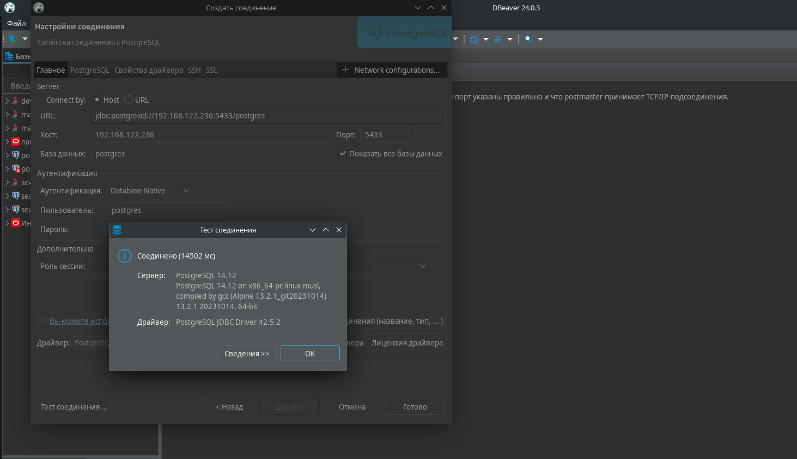

 
# Домашнее задание №2
В процессе выполнения первого домашнего задания требуется создать инстанс виртуальной машины, воспользовавшись услугами одного из облачных провайдеров (например, Yandex Cloud). В рамках именно первого урока работа будет проводиться только на одной виртуальной машине, и специфичных для геораспределённости задач в данном случае не стоит, работа выполнена на локальной виртуальной машине. 

---
## Начало работы
Виртуальная машина создана средствами virt-manager (qemu/kvm), путём клонирования ранее созданной ВМ, ОС - Ubuntu 20.04. ОС на хосте (он же рабочее место) - Debian 12.

Кроме Docker существуют другие варианты контейнеризации. Пара примеров:

* LXC - простой вариант с несколько ограниченным функционалом
* Podman - практически полный аналог Docker, но по умолчанию не вмешивается в работу межсетевого экрана на хосте. *Обычно использую именно его для некоторых опытов или запуска некоторого ПО прямо на рабочем месте.*

В рамках урока будет использоваться *общепринятый* Docker

IP-адрес запущенной локальной ВМ - 192.168.122.236, все дальнейшие действия производятся на ней. Подключение к её терминалу:
```
azotov@main:~$ ssh user@192.168.122.236
```

Установка Docker из официального APT-репозитория описана на [сайте](https://docs.docker.com/engine/install/ubuntu/#install-using-the-repository) разработчика. Docker установлен в соответствии ей.

В рамках урока ничто не препятствует использованию Docker в Rootless-режиме, поэтому для удобства выполнения дальнейших действий (чтобы не было необходимости постоянно работать от имени root или при выполнении каждой команды вводить sudo) можно выполнить подготовку виртуальной машины по [документации](https://docs.docker.com/engine/security/rootless/) с помощью скрипта dockerd-rootless-setuptool.sh из состава официального пакета docker-ce. Но в данном случае это вызовет неудобства при подключении к образу из-за невозможности автоматической настройки сети (например - проброса портов) для контейнеров, поэтому он не будет использоваться.

```
user@bubuntu20042:~$ sudo apt install uidmap
user@bubuntu20042:~$ sudo systemctl disable --now docker.service docker.socket
user@bubuntu20042:~$ sudo rm /var/run/docker.sock
user@bubuntu20042:~$ dockerd-rootless-setuptool.sh install
```

Для проверки работоспособности сервера и Docker, создан и запущен контейнер PostgreSQL-14, собранный на основе Alpine Linux (этот вариант выбран из-за его компактности, и в дальнейшем будет использоваться он же):
```
user@bubuntu20042:~$ docker run --name postgres1 -e POSTGRES_PASSWORD=mysecretpassword -d postgres:14-alpine
Unable to find image 'postgres:14-alpine' locally
14-alpine: Pulling from library/postgres
4abcf2066143: Pull complete 
aa96acfaa187: Pull complete 
5b1a6189de61: Pull complete 
19b7db3e9895: Pull complete 
69009c39cd98: Pull complete 
3df02e454c0c: Pull complete 
67dddb9d50b9: Pull complete 
a0b8dc75c503: Pull complete 
83cc20ee985a: Pull complete 
Digest: sha256:f95a8cb8411aac06dd98ea44d6a810476d1b07358858f6d81177264b6eb5e9dd
Status: Downloaded newer image for postgres:14-alpine
74e61207b1b46a51b43821761cc496b577389ff97552ddc536a58d7e8075f2fa
```

Так как ранее этот образ не использовался, перед запуском он загрузился из Docker Hub. Проверить существование и (частично) работоспособность контейнера можно командой:
```
user@bubuntu20042:~$ docker ps
CONTAINER ID   IMAGE                COMMAND                  CREATED         STATUS         PORTS      NAMES
618b5ecc0648   postgres:14-alpine   "docker-entrypoint.s…"   4 seconds ago   Up 3 seconds   5432/tcp   postgres1
```
По статусу контейнера "Up" можно сделать вывод что он запустился и работает. Далее этот контейнер удалён командами:
```
user@bubuntu20042:~$ docker stop postgres1
user@bubuntu20042:~$ docker rm postgres1
```
---
## Контейнеры и связь между ними
Для обеспечения связи контейнеров между собой, требуется подключить их к общему сетевому мосту. Также есть возможность подключить их к сети самого хоста, в данном случае все порты, прослушиваемые контейнерами, будут прослушиваться виртуально самим хостом, но это затруднит запуск нескольких однотипных контейнеров, прослушивающих одни и те же порты (потребуется изменить конфигурацию ПО внутри контейнера таким образом чтобы не было совпадений прослушиваемых портов).

Создание сетевого моста:
```
user@bubuntu20042:~$ docker network create localbridge
3ae9d3567f5952b614f2db868b9afecc5b43654949c3a38e93c6bd48050c89f1
user@bubuntu20042:~$ docker network ls
NETWORK ID     NAME          DRIVER    SCOPE
7da1d0f0f42d   bridge        bridge    local
9267b7776aba   host          host      local
3ae9d3567f59   localbridge   bridge    local
654d9d33cb94   none          null      local
```

При создании контейнера с PostgreSQL вручную, он по умолчанию прослушивает только сетевой интерфейс внутри сети, к которой он подключен. Если требуется возможность подключения к нему с других хостов - требуется опубликовать (пробросить) порт.

По умолчанию ПО в контейнерах производит запись данных в собственную файловую систему, содержимое которой не сохраняется при перезапуске или пересоздании контейнеров. Для СУБД отсутствие возможности сохранения данных при перезапуске в большинстве случаев неприемлемо, поэтому нужно сделать так чтобы в каталог данных СУБД внутри контейнера монтировалась какая-либо директория на диске хоста (например, это может быть отдельный быстрый SSD или массив). 
```
user@bubuntu20042:~$ sudo mkdir -p /var/lib/postgresql
user@bubuntu20042:~$ sudo chown user:user /var/lib/postgresql/
```

Создание контейнера с подключением его к созданному сетевому мосту, публикацией порта для PostgreSQL, и монтированием каталога данных:
```
user@bubuntu20042:~$ docker run --name postgres1 -e POSTGRES_PASSWORD=mysecretpassword -d --network localbridge -p 5433:5432 -v /var/lib/postgresql:/var/lib/postgresql/data postgres:14-alpine
```
опции:

* `--name postgres1` - имя контейнера, по которому к нему можно подключиться, оно же отображается в списке контейнеров по команде `docker ps`;
* `-e POSTGRES_PASSWORD=mysecretpassword` - пароль пользователя postgres, требуется для запуска PostgreSQL внутри контейнера (*не забыть указать действительно уникальный пароль!*);
* `--network localbridge` - подключение контейнера к мосту;
* `-p 5433:5432` - публикация порта, порт 5433 хоста пробрасывается в порт 5432 контейнера;
* `-d` (оно же `--detach`) - запуск контейнера в фоне;
* `-v /var/lib/postgresql:/var/lib/postgresql/data` - монтирование локальной папки /var/lib/postgresql в каталог данных PostgreSQL внутри контейнера;
* `postgres:14-alpine` - имя и версия образа, из которого разворачивается контейнер.

Можно проверить что контейнер запустился:
```
user@bubuntu20042:~$ docker ps
CONTAINER ID   IMAGE                COMMAND                  CREATED          STATUS         PORTS                                       NAMES
c36ef82dd626   postgres:14-alpine   "docker-entrypoint.s…"   26 minutes ago   Up 2 seconds   0.0.0.0:5433->5432/tcp, :::5433->5432/tcp   postgres1
```

---
## Подключение к PostgreSQL в контейнере
Проверить доступность порта, прослушиваемого PostgreSQL, можно с самого хоста (используя опубликованный порт):
```
user@bubuntu20042:~$ telnet localhost 5433
Trying 127.0.0.1...
Connected to localhost.
Escape character is '^]'.
```
...или попробовав подключиться к PostgreSQL из самого запущенного контейнера:
```
user@bubuntu20042:~$ docker exec -it postgres1 psql -U postgres
psql (14.12)
Type "help" for help.

postgres=#
```
Для проверки доступности порта PostgreSQL из других контейнеров, требуется создать ещё один контейнер, содержащий клиент PostgreSQL. Так как не существует официального образа PostgreSQL, содержащего *только* postgresql-client, второй контейнер создан с использованием уже загруженного образа, по аналогии с первым контейнером, только без публикации порта и монтирования каталога данных (так как сервер PostgreSQL в данном случае использоваться не будет):
```
user@bubuntu20042:~$ docker run --name postgres2 -e POSTGRES_PASSWORD=mysecretpassword -d --network localbridge postgres:14-alpine
166aecea7db2dba80e2b76aa1ac01981294387a86836a899624407c8bc01f420
user@bubuntu20042:~$ docker exec -it postgres2 psql -U postgres -h postgres1
Password for user postgres: 
psql (14.12)
Type "help" for help.

postgres=# 
```
В этой команде выполнен запуск утилиты psql из только что созданного контейнера postgres2 с подключением к PostgreSQL в контейнере postgres1 по сетевому имени (DNS) этого контейнера и стандартному порту - 5432, так как контейнером postgres1 в пределах сети localbridge прослушивается именно он.

Также можно подключиться к службе PostgreSQL с хоста, на котором работает Docker.
```
user@bubuntu20042:~$ psql -h postgresql1-restore -p 5433 -U postgres
psql: ошибка: преобразовать имя "postgresql1-restore" в адрес не удалось: Temporary failure in name resolution
```
Подключиться по имени контейнера не удалось, так как информации о нём нет в DNS, к которому подключен хост с Docker. Подобным образом можно подключаться только с других контейнеров на этом же хосте. Но всё ещё можно подключиться по IP-адресу. Для этого выясним IP-адрес контейнера:
```
user@bubuntu20042:~$ docker inspect postgres1 | grep "IPAddress"
            "SecondaryIPAddresses": null,
            "IPAddress": "",
                    "IPAddress": "172.18.0.2",
```
В данном случае, можно подключиться к контейнеру по IP-адресу 172.18.0.2. Но так как этот контейнер запущен с публикацией порта, можно подключиться именно по нему по адресу 127.0.0.1:
```
sudo apt install postgresql-client-14
user@bubuntu20042:~$ psql -h localhost -p 5433 -U postgres
Пароль пользователя postgres: 
psql (14.12 (Ubuntu 14.12-1.pgdg20.04+1))
Введите "help", чтобы получить справку.

postgres=#
```
Был установлен клиент PostgreSQL для командной строки - утилита psql, из официального APT-репозитория PGDG (настроен по [документации](https://www.postgresql.org/download/linux/ubuntu/)) и выполнено подключение к опубликованному порту.
Также, можно поделючиться из любого другого места, откуда доступен хост с Docker и запущенным контейнером:

В данном случае было выполнено подключение к виртуальной машине, на которой в ходе выполнения этого домашнего задания изучается работа PostgreSQL в контейнерах.

---
## Сохранность данных СУБД при удалении контейнера
Для проверки сохранности данных требуется создать некие данные. Для этого выполнено подключение к PostgreSQL из второго контейнера и выполнено несколько SQL-запросов для создания таблицы, создания пары строк, и просмотра таблицы:
```
user@bubuntu20042:~$ docker exec -it postgres2 psql -U postgres -h postgres1
Password for user postgres: 
psql (14.12)
Type "help" for help.

postgres=# \dt
Did not find any relations.
postgres=# CREATE TABLE persons(id serial, first_name text, second_name text);
CREATE TABLE
postgres=# INSERT INTO persons(first_name, second_name) values('ivan', 'ivanov');
INSERT 0 1
postgres=# INSERT INTO persons(first_name, second_name) values('petr', 'petrov');
INSERT 0 1
postgres=# \dt
          List of relations
 Schema |  Name   | Type  |  Owner   
--------+---------+-------+----------
 public | persons | table | postgres
(1 row)
postgres=# SELECT * FROM persons;
 id | first_name | second_name 
----+------------+-------------
  1 | ivan       | ivanov
  2 | petr       | petrov
(2 rows)
```

Далее, удалён контейнер с используемым сервером PostgreSQL:
```
user@bubuntu20042:~$ docker stop postgres1
postgres1
user@bubuntu20042:~$ docker rm postgres1 
postgres1
user@bubuntu20042:~$ docker ps
CONTAINER ID   IMAGE                COMMAND                  CREATED          STATUS          PORTS      NAMES
166aecea7db2   postgres:14-alpine   "docker-entrypoint.s…"   34 minutes ago   Up 34 minutes   5432/tcp   postgres2
```
Создан другой контейнер с сервером PostgreSQL, с монтированием старого каталога данных:
```
user@bubuntu20042:~$ docker run --name postgres1-restore -e POSTGRES_PASSWORD=mysecretpassword -d --network localbridge -p 5433:5432 -v /var/lib/postgresql:/var/lib/postgresql/data postgres:14-alpine 
938e305095e598ba049a6be59cfb8f13e8d83c68a6315d5f1544659a51cd75ac
user@bubuntu20042:~$ docker ps
CONTAINER ID   IMAGE                COMMAND                  CREATED          STATUS          PORTS                                       NAMES
938e305095e5   postgres:14-alpine   "docker-entrypoint.s…"   4 seconds ago    Up 4 seconds    0.0.0.0:5433->5432/tcp, :::5433->5432/tcp   postgres1-restore
166aecea7db2   postgres:14-alpine   "docker-entrypoint.s…"   37 minutes ago   Up 37 minutes   5432/tcp                                    postgres2
```
Подобным образом можно выполнять перенос каталога данных на другие сервера (в том числе, и для запуска PostgreSQL без использования контейнеров, потребуется соответствующим образом изменить PGDATA для сервера).
```
user@bubuntu20042:~$ docker exec -it postgres2 psql -U postgres -h postgres1-restore
Password for user postgres: 
psql (14.12)
Type "help" for help.

postgres=# \dt
          List of relations
 Schema |  Name   | Type  |  Owner   
--------+---------+-------+----------
 public | persons | table | postgres
(1 row)

postgres=# SELECT * FROM persons;
 id | first_name | second_name 
----+------------+-------------
  1 | ivan       | ivanov
  2 | petr       | petrov
(2 rows)
```
При подключении к новому контейнеру видно, что созданное ранее наполнение СУБД сохранилось.