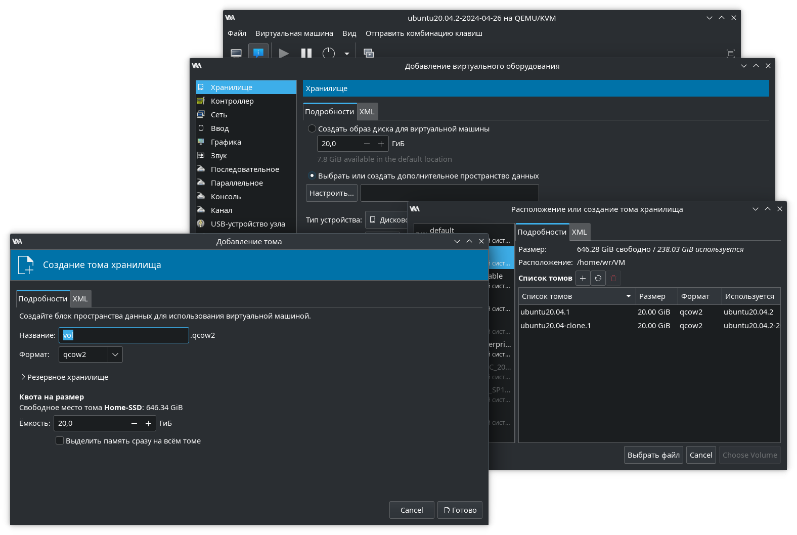
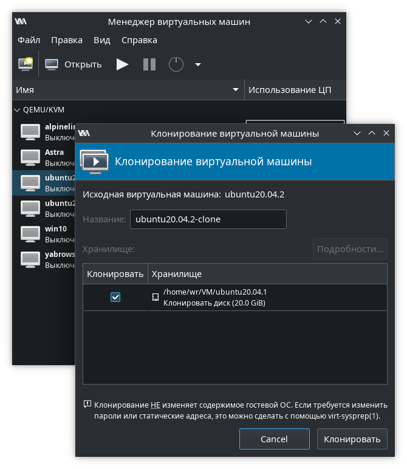
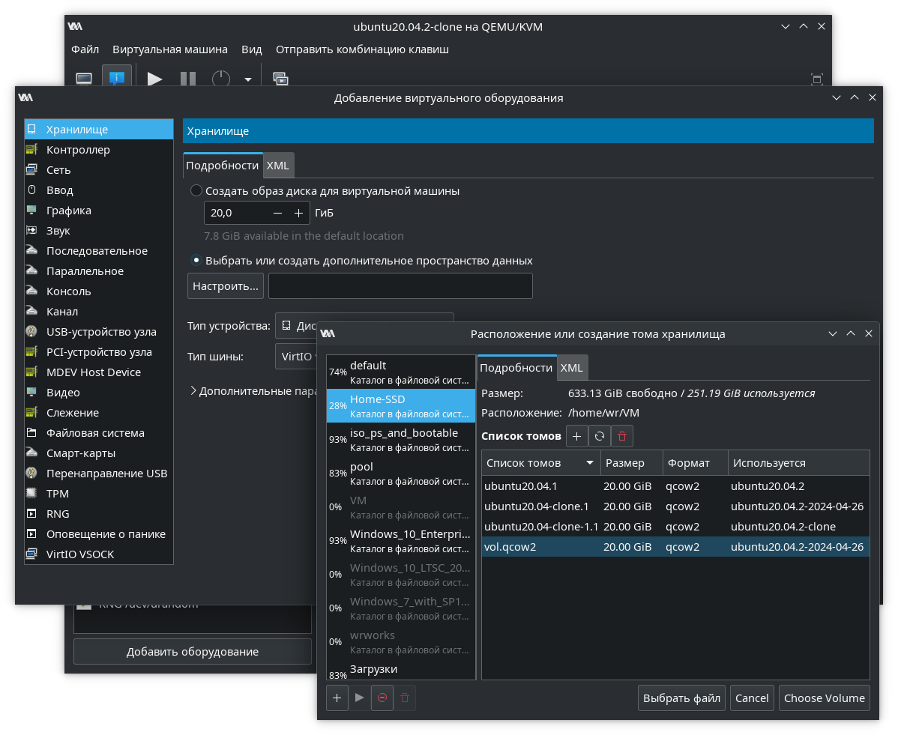
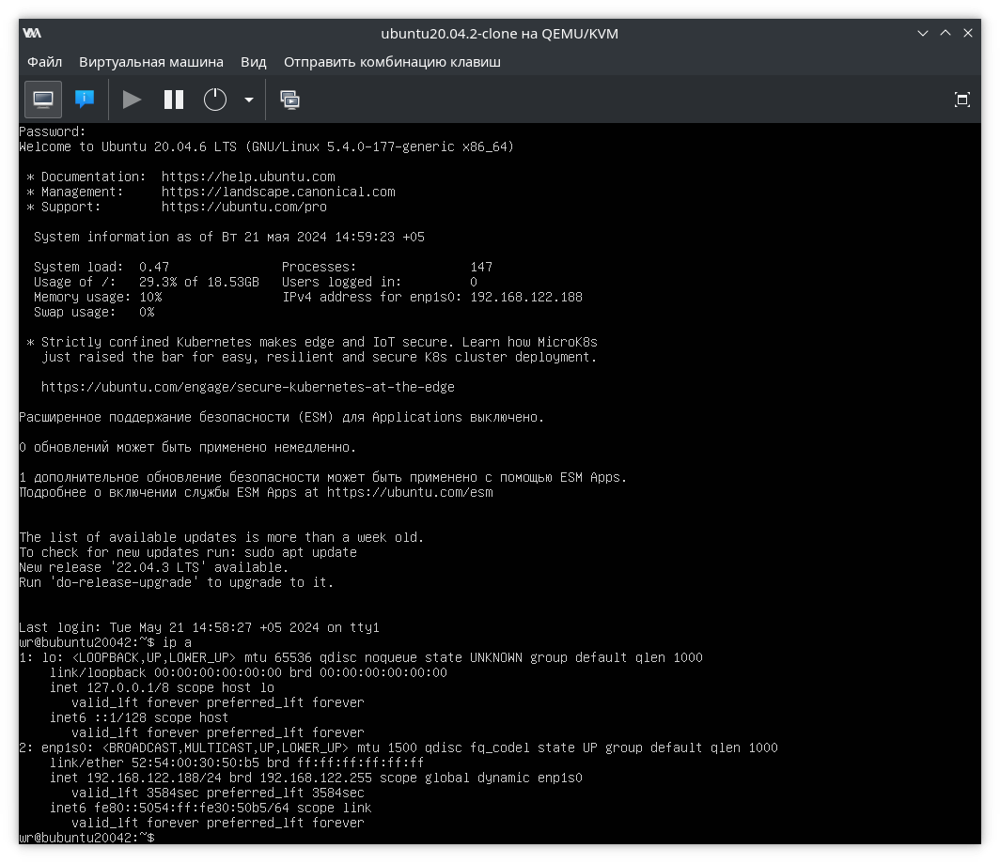

 
# Домашнее задание №3
В процессе выполнения первого домашнего задания требуется создать инстанс виртуальной машины, воспользовавшись услугами одного из облачных провайдеров (например, Yandex Cloud). В рамках именно первого урока работа будет проводиться только на одной виртуальной машине, и специфичных для геораспределённости задач в данном случае не стоит, работа выполнена на локальной виртуальной машине. 

---
## Начало работы
APT-репозиторий PGDG настроен по документации с сайта [postgresql.org](https://www.postgresql.org/download/linux/ubuntu/). Использоваться будет версия 15, поэтому СУБД установлена командой:
```
user@ubuntu20042:~$ sudo apt install postgresql-15
```
При установке на Ubuntu (равно как и на других Debian-based дистрибутивах) кластер PostgreSQL инициализируется и запускается автоматически после установки пакета. При необходимости можно проверить статус службы PostgreSQL:
```
user@ubuntu20042:~$ sudo -u postgres pg_lsclusters
Ver Cluster Port Status Owner    Data directory              Log file
15  main    5432 online postgres /var/lib/postgresql/15/main /var/log/postgresql/postgresql-15-main.log
```
Или, средствами Systemd:
```
user@ubuntu20042:~$ systemctl status postgresql@15-main.service 
● postgresql@15-main.service - PostgreSQL Cluster 15-main
     Loaded: loaded (/lib/systemd/system/postgresql@.service; enabled-runtime; vendor preset: enabled)
     Active: active (running) since Sun 2024-05-05 22:30:47 +05; 4min 6s ago
    Process: 5556 ExecStart=/usr/bin/pg_ctlcluster --skip-systemctl-redirect 15-main start (code=exited, stat>
   Main PID: 5574 (postgres)
      Tasks: 6 (limit: 2256)
     Memory: 20.1M
     CGroup: /system.slice/system-postgresql.slice/postgresql@15-main.service
             ├─5574 /usr/lib/postgresql/15/bin/postgres -D /var/lib/postgresql/15/main -c config_file=/etc/po>
             ├─5575 postgres: 15/main: checkpointer
             ├─5576 postgres: 15/main: background writer
             ├─5578 postgres: 15/main: walwriter
             ├─5579 postgres: 15/main: autovacuum launcher
             └─5580 postgres: 15/main: logical replication launcher
```
Сервер PostgreSQL запущен, теперь для проверки результатов дальнейших действий требуется записать в БД какие-либо данные. Подключение к СУБД, и создание индикаторных таблицы и строки:
```
user@ubuntu20042:~$ sudo -u postgres psql
psql (15.7 (Ubuntu 15.7-1.pgdg20.04+1))
Введите "help", чтобы получить справку.

postgres=# create table test(c1 text);
CREATE TABLE
postgres=# insert into test values('1');
INSERT 0 1
postgres=# select * from test;
 c1 
----
 1
(1 строка)
```
---
## Подключение дополнительного диска к серверу
Можно подключить к виртуальной дополнительный диск средствами гипервизора. В данном случае, используется QEMU/KVM под управлением утилиты virt-manager:



Так как при помощи virt-manager невозможно внести изменения в виртуальную машину, после добавления диска её требуется перезапустить. После перезапуска подключенный диск `/dev/vdb` виден в системе:
```
user@ubuntu20042:~$ lsblk
NAME                      MAJ:MIN RM  SIZE RO TYPE MOUNTPOINT
loop0                       7:0    0 91,8M  1 loop /snap/lxd/23991
loop1                       7:1    0   64M  1 loop /snap/core20/2264
loop2                       7:2    0 38,8M  1 loop /snap/snapd/21465
loop3                       7:3    0   64M  1 loop /snap/core20/2318
loop4                       7:4    0 55,6M  1 loop /snap/core18/2654
loop5                       7:5    0 55,7M  1 loop /snap/core18/2823
loop6                       7:6    0 49,6M  1 loop /snap/snapd/17883
loop7                       7:7    0 91,9M  1 loop /snap/lxd/24061
vda                       252:0    0   20G  0 disk 
├─vda1                    252:1    0    1M  0 part 
├─vda2                    252:2    0    1G  0 part /boot
└─vda3                    252:3    0   19G  0 part 
  └─ubuntu--vg-ubuntu--lv 253:0    0   19G  0 lvm  /
vdb                       252:16   0   20G  0 disk 
```
После того как диск стал доступен, требуется создать на нём раздел. Создание простого раздела, без использования LVM:
```
user@ubuntu20042:~$ sudo fdisk /dev/vdb
[sudo] password for user: 

Welcome to fdisk (util-linux 2.34).
Changes will remain in memory only, until you decide to write them.
Be careful before using the write command.

Device does not contain a recognized partition table.
Created a new DOS disklabel with disk identifier 0x0784dc9a.

Command (m for help): n
Partition type
   p   primary (0 primary, 0 extended, 4 free)
   e   extended (container for logical partitions)
Select (default p): p
Partition number (1-4, default 1): 1
First sector (2048-41943039, default 2048): 
Last sector, +/-sectors or +/-size{K,M,G,T,P} (2048-41943039, default 41943039): 

Created a new partition 1 of type 'Linux' and of size 20 GiB.

Command (m for help): w
The partition table has been altered.
Calling ioctl() to re-read partition table.
Syncing disks.
```
...и отформатировать его:
```
user@ubuntu20042:~$ sudo mkfs.ext4 /dev/vdb1
mke2fs 1.45.5 (07-Jan-2020)
Discarding device blocks: done                            
Creating filesystem with 5242624 4k blocks and 1310720 inodes
Filesystem UUID: 0b1835e5-8b41-4f9a-9c58-dacc81cad346
Superblock backups stored on blocks: 
        32768, 98304, 163840, 229376, 294912, 819200, 884736, 1605632, 2654208, 
        4096000

Allocating group tables: done                            
Writing inode tables: done                            
Creating journal (32768 blocks): done
Writing superblocks and filesystem accounting information: done
```
Теперь его требуется примонтировать. Создать папку для использования в качестве точки монтирования:
```
sudo mkdir /mnt/pgsql
```
...узнать UUID раздела:
```
user@ubuntu20042:~$ sudo blkid /dev/vdb1
/dev/vdb1: UUID="0b1835e5-8b41-4f9a-9c58-dacc81cad346" TYPE="ext4" PARTUUID="0784dc9a-01"
```
...добавить запись в fstab для автоматического монтирования при помощи любого текстового редактора (опции noatime и nodiratime - в данном случае в большей степени для экономии ресурса твердотельного накопителя, чем для повышения производительности):
```
/dev/disk/by-uuid/0b1835e5-8b41-4f9a-9c58-dacc81cad346 /mnt/data ext4 noatime,nodiratime 0 0
```
...и примонтировать все папки, о которых есть информация в fstab, и которые не примонтированы (либо перезагрузить виртуальную машину):
```
user@ubuntu20042:~$ sudo mount -a
user@ubuntu20042:~$ df -h
Filesystem                         Size  Used Avail Use% Mounted on
udev                               941M     0  941M   0% /dev
tmpfs                              198M  1,3M  196M   1% /run
/dev/mapper/ubuntu--vg-ubuntu--lv   19G  6,6G   12G  38% /
tmpfs                              986M  1,1M  985M   1% /dev/shm
tmpfs                              5,0M     0  5,0M   0% /run/lock
tmpfs                              986M     0  986M   0% /sys/fs/cgroup
/dev/vda2                          974M  209M  698M  24% /boot
/dev/loop0                          92M   92M     0 100% /snap/lxd/23991
/dev/loop1                          64M   64M     0 100% /snap/core20/2264
/dev/loop2                          39M   39M     0 100% /snap/snapd/21465
/dev/loop3                          64M   64M     0 100% /snap/core20/2318
/dev/loop4                          56M   56M     0 100% /snap/core18/2654
/dev/loop5                          56M   56M     0 100% /snap/core18/2823
/dev/loop6                          50M   50M     0 100% /snap/snapd/17883
/dev/loop7                          92M   92M     0 100% /snap/lxd/24061
tmpfs                              198M     0  198M   0% /run/user/1001
/dev/vdb1                           20G   24K   19G   1% /mnt/pgsql
```
Создание нового каталога данных на новом диске:
```
user@ubuntu20042:~$ sudo mkdir /mnt/pgsql/data
user@ubuntu20042:~$ sudo chown postgres:postgres /mnt/pgsql/data
```
---
## Перенос каталога данных на отдельный диск
При перезапуске сервера СУБД была запущена, требуется её остановить:
```
user@ubuntu20042:~$ sudo systemctl stop postgresql
user@ubuntu20042:~$ sudo -u postgres pg_lsclusters
Ver Cluster Port Status Owner    Data directory              Log file
15  main    5432 down   postgres /var/lib/postgresql/15/main /var/log/postgresql/postgresql-15-main.log
```
От имени пользователя postgres перенесём каталог данных на новый раздел:
```
user@ubuntu20042:~$ sudo su - postgres 
postgres@bubuntu20042:~$ mv /var/lib/postgresql/15 /mnt/pgsql/data/
```
После этого, при попытке запуска кластера возникнут проблемы:
```
postgres@bubuntu20042:~$ pg_ctlcluster 15 main start
Error: /var/lib/postgresql/15/main is not accessible or does not exist
```
Причина - postgresql ожидает наличия каталога данных только по пути, указанному в параметре data_directory (характерно для дистрибутивов Linux, основаных на Debian) или в переменной окружения PGDATA (например, в Redhat-подобных дистрибутивах Linux задаётся в systemd-юните кластера, в параметре Environment). Ubuntu основана на Debian, поэтому проще всего будет исправить параметр data_directory, установкой его значения в файле `/etc/postgresql/15/main/postgresql.conf`. В конец файла добавлена строка:
```
data_directory = '/mnt/pgsql/data/15/main'
```
После изменения параметра, можно повторно попытаться запустить кластер:
```
user@ubuntu20042:~$ sudo -u postgres pg_ctlcluster 15 main start
Warning: the cluster will not be running as a systemd service. Consider using systemctl:
  sudo systemctl start postgresql@15-main
user@ubuntu20042:~$ sudo -u postgres pg_lsclusters
Ver Cluster Port Status Owner    Data directory          Log file
15  main    5432 online postgres /mnt/pgsql/data/15/main /var/log/postgresql/postgresql-15-main.log
```
Проверка сохранности созданных ранее тестовых данных:
```
user@ubuntu20042:~$ sudo -u postgres psql
psql (15.7 (Ubuntu 15.7-1.pgdg20.04+1))
Введите "help", чтобы получить справку.

postgres=# select * from test;
 c1 
----
 1
(1 строка)
```
Можно сделать вывод что теперь данные перенесены. После этого стоит последовать рекомандации разработчиков PostgreSQL и перезапустить СУБД средствами systemd:
```
ser@bubuntu20042:~$ sudo -u postgres pg_ctlcluster 15 main stop
user@ubuntu20042:~$ sudo systemctl start postgresql
user@ubuntu20042:~$ sudo -u postgres pg_lsclusters
Ver Cluster Port Status Owner    Data directory          Log file
15  main    5432 online postgres /mnt/pgsql/data/15/main /var/log/postgresql/postgresql-15-main.log
```
---
## Дополнительное задание - перенос диска с каталогом данных в другое место
Предположим, возникли проблемы, из за которых сервер с СУБД более не запускается, но диск с каталогом данных СУБД сохранился, и требуется задействовать его на другом сервере с сохранением данных.

Старая виртуальная машина остановлена. Создаём новую (в качестве шаблона использована ВМ, на основе которой ранее создавалась прошлая тестовая машина):



Сразу подключим созданный ранее дополнительный диск, на котором уже есть каталог данных PostgreSQL:



virt-manager выведет предупреждение о том что диск уже подключен к другой машине, которое можно игнорировать и просто нажать "ОК", так как старая виртуальная машина остановлена.

Попробуем запустить новую виртуальную машину, и сразу уточним её IP, чтобы проверить что эта ВМ - новая:



Дальнейшие действия будут выполняться через SSH-консоль.

Повторно настроен APT-репозиторий PGDG по документации с сайта [postgresql.org](https://www.postgresql.org/download/linux/ubuntu/), и установлена СУБД:
```
wr@bubuntu20042:~$ sudo apt install postgresql-15
```
После установки удостоверимся, что кластер PostgreSQL работоспособен, и остановим его:
```
wr@bubuntu20042:~$ sudo -u postgres pg_lsclusters
Ver Cluster Port Status Owner    Data directory              Log file
15  main    5432 online postgres /var/lib/postgresql/15/main /var/log/postgresql/postgresql-15-main.log
wr@bubuntu20042:~$ sudo systemctl stop postgresql
```
Удалим каталог данных нового кластера, соблюдая осторожность при вводе пути:
```
wr@bubuntu20042:~$ sudo rm -rf /var/lib/postgresql/15
```
Далее, требуется примонтировать к новой виртуальной машине подключенный дополнительный диск с данными. Проверим его доступность:
```
wr@bubuntu20042:~$ lsblk
NAME                      MAJ:MIN RM  SIZE RO TYPE MOUNTPOINT
loop0                       7:0    0 63,2M  1 loop /snap/core20/1738
loop1                       7:1    0 91,9M  1 loop /snap/lxd/24061
loop2                       7:2    0 91,8M  1 loop /snap/lxd/23991
loop3                       7:3    0   64M  1 loop /snap/core20/2318
loop4                       7:4    0 55,6M  1 loop /snap/core18/2654
loop5                       7:5    0 49,6M  1 loop /snap/snapd/17883
loop6                       7:6    0 55,7M  1 loop /snap/core18/2823
vda                       252:0    0   20G  0 disk 
├─vda1                    252:1    0    1M  0 part 
├─vda2                    252:2    0    1G  0 part /boot
└─vda3                    252:3    0   19G  0 part 
  └─ubuntu--vg-ubuntu--lv 253:0    0   19G  0 lvm  /
vdb                       252:16   0   20G  0 disk 
└─vdb1                    252:17   0   20G  0 part 
```
Узнаем его UUID:
```
wr@bubuntu20042:~$ blkid /dev/vdb1
/dev/vdb1: UUID="0b1835e5-8b41-4f9a-9c58-dacc81cad346" TYPE="ext4" PARTUUID="0784dc9a-01"
```
Создадим точку монтирования по пути /mnt/pgdata, и добавим запись в fstab:
```
/dev/disk/by-uuid/0b1835e5-8b41-4f9a-9c58-dacc81cad346 /mnt/pgdata ext4 noatime,nodiratime 0 0
```
После этого можно примонтировать диск, и проверить его содержимое:
```
wr@bubuntu20042:~$ sudo mount -a
wr@bubuntu20042:~$ df -h
Filesystem                         Size  Used Avail Use% Mounted on
udev                               941M     0  941M   0% /dev
tmpfs                              198M  1,8M  196M   1% /run
/dev/mapper/ubuntu--vg-ubuntu--lv   19G  5,6G   12G  32% /
tmpfs                              986M     0  986M   0% /dev/shm
tmpfs                              5,0M     0  5,0M   0% /run/lock
tmpfs                              986M     0  986M   0% /sys/fs/cgroup
/dev/vda2                          974M  209M  698M  24% /boot
/dev/loop4                          56M   56M     0 100% /snap/core18/2654
/dev/loop0                          64M   64M     0 100% /snap/core20/1738
/dev/loop5                          50M   50M     0 100% /snap/snapd/17883
/dev/loop6                          56M   56M     0 100% /snap/core18/2823
/dev/loop1                          92M   92M     0 100% /snap/lxd/24061
/dev/loop2                          92M   92M     0 100% /snap/lxd/23991
/dev/loop3                          64M   64M     0 100% /snap/core20/2318
tmpfs                              198M     0  198M   0% /run/user/1000
/dev/vdb1                           20G   39M   19G   1% /mnt/pgdata
wr@bubuntu20042:~$ ls -lh /mnt/pgdata/
total 20K
drwxr-xr-x 3 postgres postgres 4,0K мая 21 14:25 data
drwx------ 2 root     root      16K мая 21 14:08 lost+found
```
Видно что старый каталог данных сохранился, и даже сохранились назначенные права (в данном случае совпали идентификаторы пользователей и групп postgres в старой и новой системе). При необходимости, можно исправить принадлежность каталога данных текущему пользователю командой:
```
wr@bubuntu20042:~$ sudo chown -R postgres:postgres /mnt/pgdata/data/
```
В случае если на новом сервере будет установлена новая мажорная версия PostgreSQL, напрямую задействовать старый каталог данных нельзя - требуется установить PostgreSQL такой же минорной версии как на старом сервере, или, при соблюдении мер предосторожности (есть проверенная резервная копия каталога данных или всех БД кластера, который требуется сохранить), более новой минорной версии в пределах такой же мажорной. В текущей ситуации версии СУБД полностью совпадают, и можно просто задействовать старый каталог данных. Установим значение data_directory в файле /etc/postgresql/15/main/postgresql.conf:
```
data_directory = '/mnt/pgdata/data/15/main'
```
Попытка запуска PostgreSQL с использованием старого каталога данных:
```
wr@bubuntu20042:~$ sudo -u postgres pg_ctlcluster 15 main start
Warning: the cluster will not be running as a systemd service. Consider using systemctl:
  sudo systemctl start postgresql@15-main
wr@bubuntu20042:~$ sudo -u postgres pg_lsclusters
Ver Cluster Port Status Owner    Data directory           Log file
15  main    5432 online postgres /mnt/pgdata/data/15/main /var/log/postgresql/postgresql-15-main.log
```
Подключение к PostgreSQL и проверка сохранности данных:
```
wr@bubuntu20042:~$ sudo -u postgres pg_lsclusters
Ver Cluster Port Status Owner    Data directory           Log file
15  main    5432 online postgres /mnt/pgdata/data/15/main /var/log/postgresql/postgresql-15-main.log
wr@bubuntu20042:~$ sudo -u postgres psql
psql (15.7 (Ubuntu 15.7-1.pgdg20.04+1))
Введите "help", чтобы получить справку.

postgres=# SELECT * FROM test;
 c1 
----
 1
(1 строка)
```
После выполнения этих операций можно перезапустить кластер PostgreSQL штатными средствами systemd и вводить сервер в работу.
