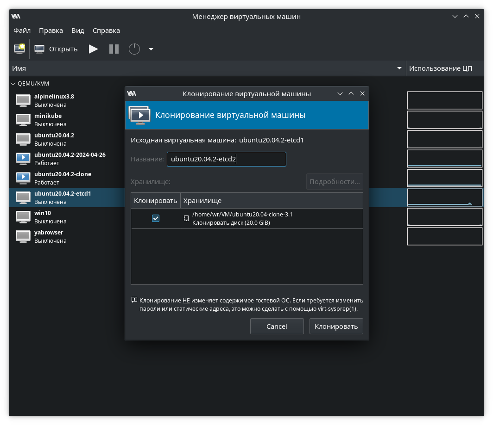
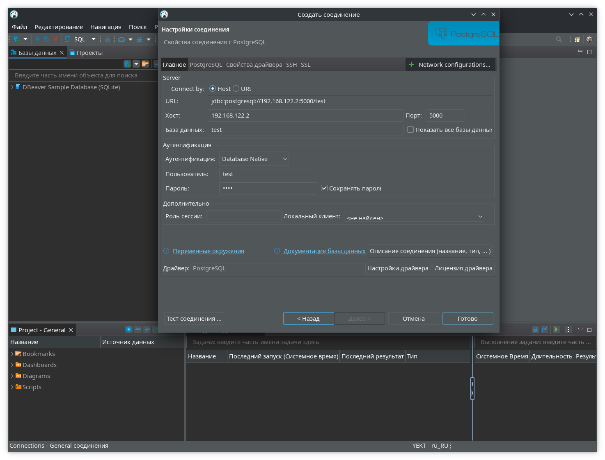
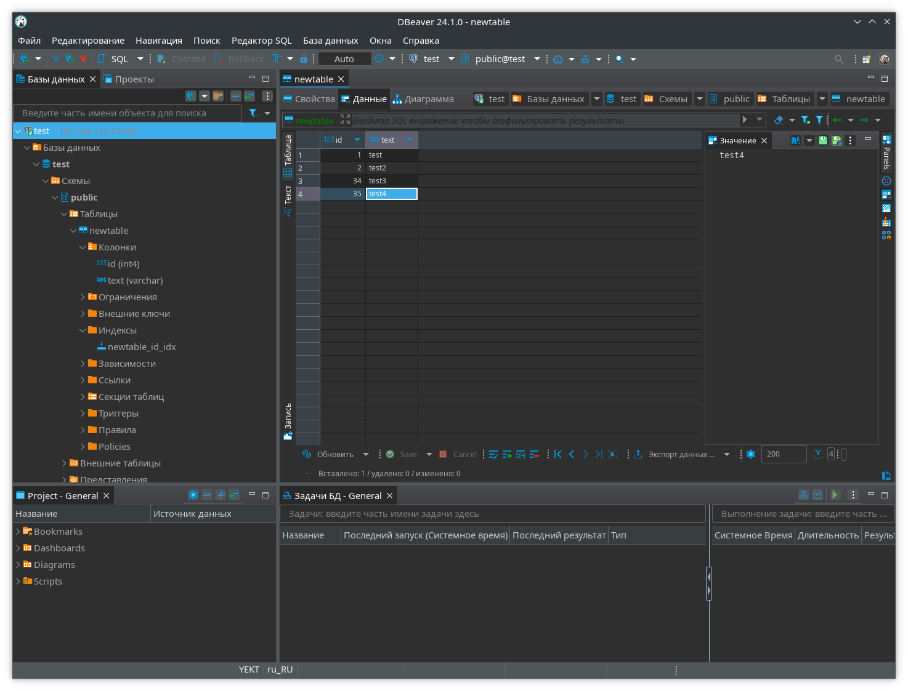

 
# Домашнее задание №07
В рамках данного задания выполняется развертывание высокодоступного кластера PostgreSQL на базе Patroni. Планируется развернуть кластер из трёх СУБД PostgreSQL, одна из которых будет работать только в режиме реплики.

---
## Подготовка
В качестве хранилища метаданных будет использоваться etcd. Высокую доступность планируется обеспечить при помощи Keepalived и HAProxy.
Для выполнения работы потребуется несколько виртуальных машин:
* На трёх виртуальных машинах будет запущена СУБД PostgreSQL, Patroni, а также Keepalived и HAProxy.
* Ещё на трёх виртуальных машинах будет запущена СУБД etcd.
Виртуальные машины создаются локально и управляются средствами virt-manager. ОС - Ubuntu 24.04.

---
## Установка etcd
Для установки одной из нод кластера etcd требуется создать одну виртуальную машину, после установки и начальной настройки etcd она будет склонирована. Поэтому, после запуска ОС требуется проверить, чтобы при получении IP-адреса ОС использовала MAC-адрес (по умолчанию Ubuntu использует идентификатор экземпляра ОС, при клонировании с такой настройкой вероятно возникновение проблем в работе сети из-за одинаковых IP на нескольких хостах). Проверить и при необходимости исправить настройку можно в файле `/etc/netplan/00-installer-config.yaml`:
```
network:
  ethernets:
    enp1s0:
      dhcp4: true
      dhcp-identifier: mac
```
Установка etcd выполнена средствами пакетного менеджера:
```
wr@etcd1:~$ sudo apt install etcd-server etcd-client
```
После установки etcd подготовлен файл с переменными окружения `/etc/default/etcd`:
```
# Имя ноды etcd (используется в переменной ETCD_INITIAL_CLUSTER), во избежание путаницы можно назначить в соответствии имени хоста.
ETCD_NAME="etcd1"

# Директория с данными (используется значение по умолчанию)
ETCD_DATA_DIR="/var/lib/etcd/default"

# Интервал проверки работоспособности нод (в миллисекундах)
ETCD_HEARTBEAT_INTERVAL="1000"
 
# Таймаут, при котором происходит выбор нового лидера (в миллисекундах)
ETCD_ELECTION_TIMEOUT="5000"
 
# IP сервера, который должна прослушивать служба etcd
#  доступ для членов кластера etcd
ETCD_LISTEN_PEER_URLS="http://0.0.0.0:2380"
#  доступ для клиентов etcd
ETCD_LISTEN_CLIENT_URLS="http://0.0.0.0:2379"
 
# Список одноранговых URL-адресов этого участника для рекламы остальной части кластера.
# Эти адреса используются для передачи данных etcd по кластеру.
# По крайней мере один из них должен быть маршрутизируем ко всем членам кластера.
# Эти URL-адреса могут содержать доменные имена.
ETCD_INITIAL_ADVERTISE_PEER_URLS="http://192.168.122.18:2380"
 
# Список URL-адресов клиентов этого участника для рекламы остальной части кластера.
# Эти URL-адреса могут содержать доменные имена.
ETCD_ADVERTISE_CLIENT_URLS="http://192.168.122.18:2379"
 
# Разделенная запятыми строка начальной конфигурации кластера для загрузки.
ETCD_INITIAL_CLUSTER="etcd1=http://192.168.122.18:2380"
 
# Инициализация состояния кластера состояние кластера.
#  "new" - используется при запуске нового (или полном перезапуске) кластера;
#  "existing" - для подключения дополнительной ноды к существующему кластеру.
ETCD_INITIAL_CLUSTER_STATE="new"
 
# начальный токен кластера
ETCD_INITIAL_CLUSTER_TOKEN="otus-study"
 
# Принятие клиентских запросов версии 2 (именно его использует Patroni).
ETCD_ENABLE_V2="true"
```
После настройки конфига временно остановлен сервис etcd и отключен его автозапуск:
```
wr@etcd1:~$ sudo systemctl disable etcd --now
```
Также, очищена директория данных etcd:
```
wr@etcd1:~$ sudo rm /var/lib/etcd/default/* -r
```
Далее, создано две копии виртуальной машины:

Получено три виртуальные машины:
*etcd1 - 192.168.122.18
*etcd2 - 192.168.122.104
*etcd3 - 192.168.122.187
С учётом новых данных, на всех машинах требуется установить корректные значения переменных окружения `ETCD_NAME`, `ETCD_INITIAL_ADVERTISE_PEER_URLS`, `ETCD_ADVERTISE_CLIENT_URLS`, а в переменной `ETCD_INITIAL_CLUSTER` указать список url всех нод:
```
ETCD_INITIAL_CLUSTER="etcd1=http://192.168.122.18:2380,etcd2=http://192.168.122.104:2380,etcd3=http://192.168.122.187:2380"
```
etcd готов к запуску, можно включить сервис на всех нодах:
```
sudo systemctl enable --now etcd
```
...и проверить статус кластера etcd:
```
wr@etcd3:~$ etcdctl endpoint status --cluster -w table
+-----------------------------+------------------+---------+---------+-----------+------------+-----------+------------+--------------------+--------+
|          ENDPOINT           |        ID        | VERSION | DB SIZE | IS LEADER | IS LEARNER | RAFT TERM | RAFT INDEX | RAFT APPLIED INDEX | ERRORS |
+-----------------------------+------------------+---------+---------+-----------+------------+-----------+------------+--------------------+--------+
|  http://192.168.122.18:2379 | 6ae6807960e3ca96 |  3.4.30 |   20 kB |      true |      false |         6 |          9 |                  9 |        |
| http://192.168.122.104:2379 | 6c3acbb9e9cf6a2c |  3.4.30 |   20 kB |     false |      false |         6 |          9 |                  9 |        |
| http://192.168.122.187:2379 | 7ec7024af8f5bb09 |  3.4.30 |   20 kB |     false |      false |         6 |          9 |                  9 |        |
+-----------------------------+------------------+---------+---------+-----------+------------+-----------+------------+--------------------+--------+
```
Выведен список действующих нод только что развернутого кластера etcd, мастером является нода etcd1.

---
## Установка PostgreSQL и Patroni
Под PostgreSQL и Patroni созданы три виртуальные машины:
*patroni1 - 192.168.122.236
*patroni2 - 192.168.122.188
*patroni3 - 192.168.122.95
PostgreSQL 16 установлен на все ноды (или на одну, если развертывание также делается методом копирования ВМ) в соответствии [документации](https://www.postgresql.org/download/linux/ubuntu/), сразу после этого стандартная служба PostgreSQL остановлена и отключен её автозапуск, так как процессом PostgreSQL будет управлять Patroni:
```
wr@patroni1:~$ sudo systemctl disable --now postgresql.service
```
Далее - очищены директории данных и конфигураций PostgreSQL (резервную копию можно не делать в случае, если СУБД только что установлена):
```
wr@patroni1:~$ sudo rm -r /var/lib/postgresql/16/main/*
wr@patroni1:~$ sudo rm -r /etc/postgresql/16/main/*
```
Установка Patroni выполнена командой:
```
wr@patroni1:~$ sudo apt install patroni
```
Конфигурация Patroni описана в файле `/etc/patroni/config.yml`
```
scope: "16-main"
namespace: "/postgresql-common/"
# параметр name должен быть уникальным на каждой ноде
name: otus-study

etcd:
  hosts: 192.168.122.18:2379,192.168.122.104:2379,192.168.122.187:2379

restapi:
  listen: 192.168.122.236:8008
  connect_address: 192.168.122.236:8008

bootstrap:
  method: pg_createcluster
  pg_createcluster:
    command: /usr/share/patroni/pg_createcluster_patroni

  dcs:
    ttl: 30
    loop_wait: 10
    retry_timeout: 10
    maximum_lag_on_failover: 1048576
    check_timeline: true
    postgresql:
      use_pg_rewind: true
      remove_data_directory_on_rewind_failure: true
      remove_data_directory_on_diverged_timelines: true
      use_slots: true
      # The following parameters are given as command line options
      # overriding the settings in postgresql.conf.
      parameters:
        max_connections: 50
        # здесь могут быть другие необходимые параметры, устанавливаемые при инициализации кластера, например настройка логирования:
        log_destination: 'stderr'
        logging_collector: 'on'
        log_directory: '/var/lib/postgresql/16/main/'
        log_filename: 'postgresql-%Y-%m-%d_%H%M%S.log'
        log_file_mode: '0644'
        min_log_message: 'info'
        log_line_prefix: '%m %a %p %q%u@%d %r %i %e'
      pg_hba:
      - local   all             all                                     peer
      - host    all             all             127.0.0.1/32            scram-sha-256
      - host    all             all             ::1/128                 scram-sha-256
      - host    all             all             192.168.122.0/24          scram-sha-256
      - local   replication     all                                     peer
      - host    replication     all             127.0.0.1/32            scram-sha-256
      - host    replication     all             ::1/128                 scram-sha-256
      - host    replication     replicator      192.168.122.0/24         scram-sha-256
  initdb:
  - encoding: UTF8
  - data-checksums
  users:
    admin:
      password: admin%
      options:
        - createrole
        - createdb

postgresql:
  create_replica_method:
    - pg_clonecluster
  pg_clonecluster:
    command: /usr/share/patroni/pg_clonecluster_patroni
  listen: "*:5432"
  connect_address: 10.107.1.67:5432
  use_unix_socket: true
  # Default Debian/Ubuntu directory layout
  data_dir: /var/lib/postgresql/16/main
  bin_dir: /usr/lib/postgresql/16/bin
  config_dir: /etc/postgresql/16/main
  pgpass: /var/lib/postgresql/16-main.pgpass
  authentication:
    replication:
      username: "replicator"
      password: "rep-pass"
    superuser:
      username: "postgres"
      password:
    rewind:
      username: "rewind"
      password: "rewind-pass"

  parameters:
    listen_addresses: "*"
    unix_socket_directories: '/var/run/postgresql/'
    # Emulate default Debian/Ubuntu logging
    logging_collector: 'on'
    log_directory: '/var/log/postgresql'
    log_filename: 'postgresql-16-main.log'
  tags:
    nofailover: false
    noloadbalance: false
    clonefrom: false
    nosync: false
```
Следует учитывать необходимость указывать уникальное имя name и корректные IP-адреса в файле на каждой ноде patroni. На ноде patroni3 также решено установить тэг nofailover равным true, чтобы она всегда работала только как реплика, например, для задач, требующих только чтение данных из БД, или для резервного копирования.

Далее, после запуска сервиса patroni на всех нодах, должен собраться кластер. Проверить статус кластера можно командой:
```
wr@patroni1:~$ patronictl -c /etc/patroni/config.yml list
+ Cluster: 16-main (7401915371818274666) -+-----------+----+-----------+
| Member      | Host            | Role    | State     | TL | Lag in MB |
+-------------+-----------------+---------+-----------+----+-----------+
| otus-study  | 192.168.122.236 | Leader  | running   |  2 |           |
| otus-study2 | 192.168.122.188 | Replica | streaming |  2 |         0 |
| otus-study3 | 192.168.122.95  | Replica | streaming |  2 |         0 |
+-------------+-----------------+---------+-----------+----+-----------+
```

---
## Обеспечение высокой доступности кластера
Требуется сделать так чтобы вероятные аварии на кластере были как можно более незаметными для подключенных клиентов, не имеющих возможности подключаться сразу ко всем нодам кластера и автоматически выбирать мастер для работы (как, например, некоторые приложения Java с JDBC-драйвером PostgreSQL), то есть кластер должен быть доступен для клиентов по одному IP. Для этого используются прокси-сервер для автоматического перенаправления запросов на требуемую ноду (например, HAProxy) и ПО, управляющее работой с виртуальными IP (например, Keepalived), подразумевая что сетевое оборудование поддерживает протоколо VRRP. В условиях тестовой инсталляции при выполнения задания решено установить это ПО на сервера СУБД:
```
wr@patroni3:~$ sudo apt install haproxy keepalived
```

Конфигурационный файл HAProxy `/etc/haproxy/haproxy.cfg`, для проксирования подключений на порт 5000 на тецущий мастер, и 5001 - на реплику:
```
global
        log /dev/log    local0
        log /dev/log    local1 notice
        chroot /var/lib/haproxy
        stats socket /run/haproxy/admin.sock mode 660 level admin expose-fd listeners
        stats timeout 30s
        user haproxy
        group haproxy
        daemon

defaults
        log     global
        mode    tcp
        retries 2
        timeout connect 4s
        timeout client  30m
        timeout server  30m
        timeout check   5s

frontend ft_postgresql
        bind    *:5000
        default_backend postgres-patroni

frontend ft_postgresql_ro
        bind    *:5001
        default_backend postgres-patroni-replica

backend postgres-patroni
        option httpchk

        http-check expect status 200
        default-server inter 3s fall 3 rise 2

        server 192.168.122.236 192.168.122.236:5432 maxconn 300 check port 8008
        server 192.168.122.188 192.168.122.188:5432 maxconn 300 check port 8008
        server 192.168.122.95 192.168.122.95:5432 maxconn 300 check port 8008

backend postgres-patroni-replica
        option httpchk

        http-check expect status 503
        default-server inter 3s fall 3 rise 2

        server 192.168.122.95 192.168.122.95:5432 maxconn 300 check port 8008
        server 192.168.122.236 192.168.122.236:5432 maxconn 300 check port 8008
        server 192.168.122.188 192.168.122.188:5432 maxconn 300 check port 8008
```
Выбор бэкенда для проксирования выбирается по коду ответа http rest api patroni: для мастер-нод patroni отвечает на запросы с http-кодом 200, для реплик - с кодом 503.

Keepalived на всех нодах настраивается путём внесения изменений в `/etc/keepalived/keepalived.conf`:
```
global_defs {
}
vrrp_script chk_haproxy { # Requires keepalived-1.1.13
    script "/usr/bin/killall -0 haproxy" # проверка состояния процесса haproxy
    interval 2 # check every 2 seconds
    weight 2 # add 2 points of prio if OK
}
vrrp_instance VI_1 {
    interface enp1s0
    state BACKUP # MASTER - если требуется чтобы сервер по умолчанию был мастером, в том числе забирал себе IP после восстановления
    priority 100 # 101 для мастера, 100 для резерва
    virtual_router_id 69
    authentication {
        auth_type PASS
        auth_pass localpwd
    }
    virtual_ipaddress {
        192.168.122.2
    }
    track_script {
        chk_haproxy
    }
}
```
---
## Проверка высокой доступности PostgreSQL
 Для возможности подключения на мастере сначала создан тестовый пользователь `test` и одноименная тестовая БД. В качестве тестового клиента будет использован DBeaver:

После подключения, через графический интерфейс создана таблица newtable с ячейками id и text, добавлено несколько строк:

Перед имитацией аварии на одной из реплик выведен список нод кластера:
```
wr@patroni2:~$ patronictl -c /etc/patroni/config.yml list
+ Cluster: 16-main (7401915371818274666) -+-----------+----+-----------+
| Member      | Host            | Role    | State     | TL | Lag in MB |
+-------------+-----------------+---------+-----------+----+-----------+
| otus-study  | 192.168.122.236 | Leader  | running   |  2 |           |
| otus-study2 | 192.168.122.188 | Replica | streaming |  2 |         0 |
| otus-study3 | 192.168.122.95  | Replica | streaming |  2 |         0 |
+-------------+-----------------+---------+-----------+----+-----------+
```
Судя по выводу, со времени прошлой проверки ничего не поменялось. Для проверки гипотетической высокой доступности принудительно остановлена виртуальная машина patroni1. Для проверки того что СУБД всё ещё доступна с текущими данными, выполнена попытка создания ещё пары строк, успешная, то есть СУБД всё ещё доступна. При этом, при проверке состава кластера видно что нода otus-study2 стала мастером:
```
wr@patroni2:~$ patronictl -c /etc/patroni/config.yml list
+ Cluster: 16-main (7401915371818274666) -+-----------+----+-----------+
| Member      | Host            | Role    | State     | TL | Lag in MB |
+-------------+-----------------+---------+-----------+----+-----------+
| otus-study2 | 192.168.122.188 | Leader  | running   |  3 |           |
| otus-study3 | 192.168.122.95  | Replica | streaming |  3 |         0 |
+-------------+-----------------+---------+-----------+----+-----------+
```
После запуска остановленной виртуальной машины, СУБД на ней вернулась в строй, но осталась в статусе реплики:
```
wr@patroni2:~$ patronictl -c /etc/patroni/config.yml list
+ Cluster: 16-main (7401915371818274666) -+-----------+----+-----------+
| Member      | Host            | Role    | State     | TL | Lag in MB |
+-------------+-----------------+---------+-----------+----+-----------+
| otus-study  | 192.168.122.236 | Replica | streaming |  3 |         0 |
| otus-study2 | 192.168.122.188 | Leader  | running   |  3 |           |
| otus-study3 | 192.168.122.95  | Replica | streaming |  3 |         0 |
+-------------+-----------------+---------+-----------+----+-----------+
```
---
## Вывод
Описан один из вариантов обеспечения высокой доступности PostgreSQL. В некоторых случаях он может быть проще (в случае если клиентское приложение имеет возможность подключения к нескольким экземплярам СУБД и определения, какой из этих экземпляров является мастером), или сложнее (геораспределенность и standby-кластер в другом регионе), в зависимости от потребностей. В любом случае не стоит забывать о мониторинге, и организации реагирования специалистов на алерты.