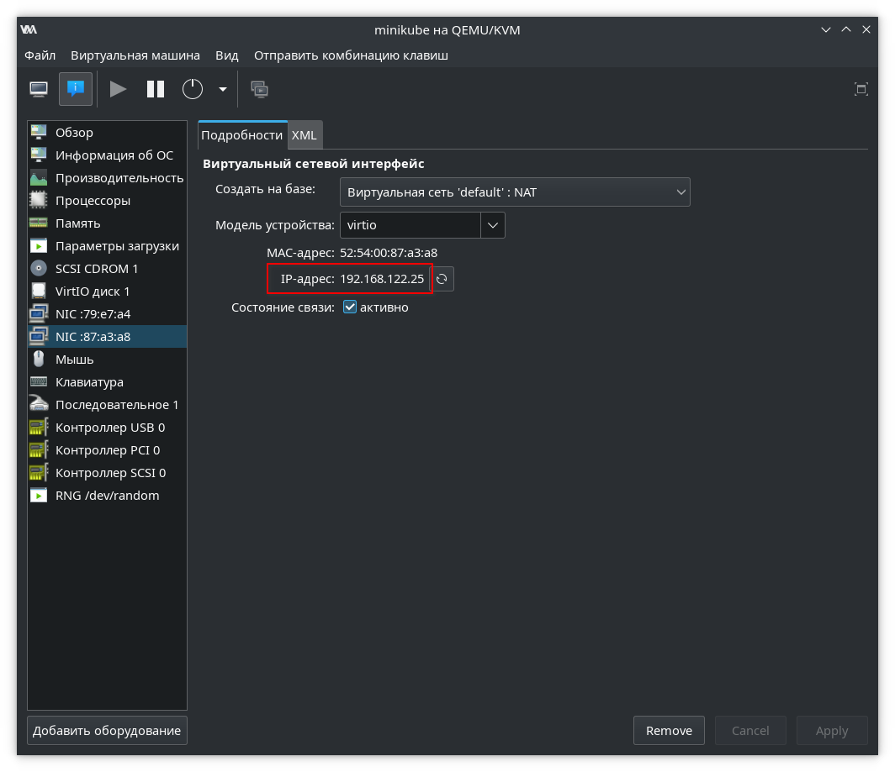
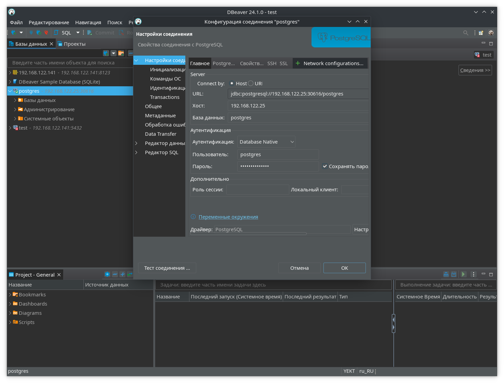

 
# Домашнее задание №09
В рамках данного задания выполняется запуск СУБД PostgreSQL с использованием оркестрации.

---
## Подготовка
Работа выполняется на компьютере с Ryzen 7 5700X, 32 ГБ ОЗУ, ОС - Debian 12.

Для выполнения работы требуется kubernetes. Установка minikube:
```
wget https://storage.googleapis.com/minikube/releases/latest/minikube_latest_amd64.deb -O /tmp/minikube_latest_amd64.deb
sudo dpkg -i /tmp/minikube_latest_amd64.deb
```
Для работы minikube требуется установленный гипервизор, например qemu-kvm. На момент выполнения задания на компьютере уже присутствуют установленные qemu-kvm (в качестве зависимости virt-manager) и Docker, поэтому дополнительные действия не требуются.

Для возможности работы с виртуальными машинами от имени пользователей кроме root, стоит добавить текущего пользователя в группу kvm, если он не добавлен, и после этого переподключиться к терминалу:
```
sudo usermod -a -G kvm user
```
Установка kubectl в Debian:
```
sudo apt install kubernetes-client
```
Следует иметь в виду, что версия kubectl из репозитория Debian может иметь достаточно старую версию, и, вероятно, стоит установить kubectl в виде бинарника, как описано в [документации](https://kubernetes.io/docs/tasks/tools/install-kubectl-linux/). Бинарный файл helm сохранен в `/usr/local/bin/`.

Установка Helm при помощи штатного пакетного менеджера описана в [документации](https://helm.sh/docs/intro/install/). После установки, для упрощения работы в виде автодополнения команд и подсказок в текущей сессии bash, можно выполнить команду:
```
source <(helm completion bash)
```
Если есть необходимость сохранить автодополнение команд для helm, можно добавить системные настройки, которые будут применяться для всех сессий терминала, при помощи команды:
```
helm completion bash > /etc/bash_completion.d/helm
```

Запустить minikube можно при помощи команды:
```
minikube start --memory=8192 --cpus=4
```
При этом будет создана виртуальная машина minikube (её видно в virt-manager) и преднастроен .kube/config для подключения kubectl к запущенному kubernetes.

## Манифест

Все части можно объединить в один файл, но для удобства демонстрации они применяются по отдельности.

### ConfigMap
Зададим несколько переменных окружения для контейнера postgres - название БД, имя суперпользователя и его пароль.
```
apiVersion: v1
kind: ConfigMap
metadata:
  name: postgres-secret
  labels:
    app: postgres
data:
  POSTGRES_DB: postgres
  POSTGRES_USER: postgres
  POSTGRES_PASSWORD: SecurePassword
```
Пароль лучше бы хранить в месте, недоступном для посторонних глаз (например, в продуктивных инсталляциях можно подключить внешний Vault). Можно также создать secret в kubernetes, но в таком случае он всё равно может быть доступен.
Применим манифест и выведем список ConfigMap:
```
wr@main:~$ kubectl apply -f pg_configmap.yml 
configmap/postgres-secret created
wr@main:~$ kubectl get configmap
NAME               DATA   AGE
kube-root-ca.crt   1      87m
postgres-secret    3      10s

```

### Persistent Volume
Сохранение данных в контейнерах не предусмотрено идеологией оркестрации, поэтому создадим постоянное хранилище, в котором будут храниться данные СУБД:
```
apiVersion: v1
kind: PersistentVolume
metadata:
  name: postgres-volume
  labels:
    type: local
    app: postgres
spec:
  storageClassName: manual
  capacity:
    storage: 10Gi
  accessModes:
    - ReadWriteMany
  hostPath:
    path: /data/psql
```
Путь в path должен существовать в файловой системе на виртуальной машине minikube, т.к. в данном случае он работает на основе qemu-kvm. Директория /data выбрана так как она сохраняется при перезапуске виртуальных машин.

Применение манифеста и вывод списка хранилищ:
```
wr@main:~$ kubectl apply -f pg_pv.yml 
persistentvolume/postgres-volume created
wr@main:~$ kubectl get pv
NAME              CAPACITY   ACCESS MODES   RECLAIM POLICY   STATUS   CLAIM                           STORAGECLASS   VOLUMEATTRIBUTESCLASS   REASON   AGE
postgres-volume   5Gi        RWX            Retain           Bound    default/postgres-volume-claim   manual         <unset>                          28s
```

### Persistent Volume Claim
Для обеспечения доступа подов к хранилищу, требуется настроить Claim.
```
apiVersion: v1
kind: PersistentVolumeClaim
metadata:
  name: postgres-volume-claim
  labels:
    app: postgres
spec:
  storageClassName: manual
  accessModes:
    - ReadWriteMany
  resources:
    requests:
      storage: 5Gi
```

Применение манифеста и вывод списка *клеймов*:
```
wr@main:~$ kubectl apply -f pg_pvc.yml 
persistentvolumeclaim/postgres-volume-claim created
wr@main:~$ kubectl get pvc
NAME                    STATUS   VOLUME            CAPACITY   ACCESS MODES   STORAGECLASS   VOLUMEATTRIBUTESCLASS   AGE
postgres-volume-claim   Bound    postgres-volume   5Gi        RWX            manual         <unset>                 27s
```

### StatefulSet
Для работы PostgreSQL, обычно требуется сохранение данных СУБД при перезапусках. Для того чтобы pod с PostgreSQL запускался с одним и тем же именем и настройками хранилища, вместо Deployment следует использовать StatefulSet.
```
apiVersion: apps/v1
kind: StatefulSet
metadata:
  name: postgres-statefulset
spec:
  serviceName: "postgres"
  replicas: 1
  selector:
    matchLabels:
      app: postgres
  template:
    metadata:
      labels:
        app: postgres
    spec:
      containers:
      - name: postgres
        image: postgres:14
        imagePullPolicy: IfNotPresent
        ports:
        - containerPort: 5432
        envFrom:
            - configMapRef:
                name: postgres-secret
        volumeMounts:
            - mountPath: /var/lib/postgresql/data
              name: postgresdata
      volumes:
        - name: postgresdata
          persistentVolumeClaim:
            claimName: postgres-volume-claim
```
Здесь кроме прочих параметров перечислены docker-образ, из которого планируется разворачивать PostgreSQL и его версияб а также упоминания ConfigMap и PVC (это всё можно было собрать в одном файле, но он был бы трудночитаем). Применим написанный манифест и просмотрим список:
```
wr@main:~$ kubectl apply -f pg_statefulset.yaml 
statefulset.apps/postgres-statefulset created
wr@main:~$ kubectl get statefulsets
NAME                   READY   AGE
postgres-statefulset   1/1     4m28s
```

### Service
В сервисах описывается набор подов, для обеспечения возможности обращения к ним без необходимости знать IP-адрес.
```
apiVersion: v1
kind: Service
metadata:
  name: postgres
  labels:
    app: postgres
spec:
  type: NodePort
  ports:
    - port: 5432
  selector:
    app: postgres
```
Применение манифеста и вывод списка сервисов:
```
wr@main:~$ kubectl apply -f pg_service.yml 
service/postgres created
wr@main:~$ kubectl get svc
NAME         TYPE        CLUSTER-IP     EXTERNAL-IP   PORT(S)          AGE
kubernetes   ClusterIP   10.96.0.1      <none>        443/TCP          92m
postgres     NodePort    10.102.97.98   <none>        5432:30616/TCP   13s
```
Здесь выведен также список прослушиваемых портов, прослушиваемых сервисами внутри подов, а также опубликованные порты для обращения извне Kubernetes. В данном случае minikube работает в виртуальной машине, поэтому под пробрасывается также внутрь виртуальной машины, то есть если есть необходимость подключиться с хоста - требуется вводить именно адрес виртуальной машины (а если с другого хоста - настраивать проброс портов далее, или запускать minikube нативно на хосте, или не использовать minikube вовсе, т.к. этот инструмент более подходит для разработки, а не для постоянной эксплуатации сервисов).

## Работа с PostgreSQL
Запустить консоль psql можно прямо внутри пода:
```
kubectl exec -it postgres-statefulset-0 -- psql -U postgres
```

Попробуем создать немного тестовых данных:
```
postgres=# create database test;
```

После этого командой \q выйдем из консоли и удалим под (предположим, что он, например, завис):
```
kubectl delete pod postgres-statefulset-0 --grace-period=0 --force
```
Опции `--grace-period` и `--force` полезны при необходимости немедленно удалить под, который по каким-то причинам не завершает свою работу.

После удаления пода он создался заново:
```
wr@main:~$ kubectl get pods
NAME                     READY   STATUS    RESTARTS   AGE
postgres-statefulset-0   1/1     Running   0          99s
```
После пересоздания пода повторно запустим его консоль и посмотрим, сохранилась ли созданная ранее БД:
```
wr@main:~$ kubectl exec -it postgres-statefulset-0 -- psql -U postgrespsql (14.12 (Debian 14.12-1.pgdg120+1))
Type "help" for help.

postgres=# \l
                                 List of databases
   Name    |  Owner   | Encoding |  Collate   |   Ctype    |   Access privileges   
-----------+----------+----------+------------+------------+-----------------------
 postgres  | postgres | UTF8     | en_US.utf8 | en_US.utf8 | 
 template0 | postgres | UTF8     | en_US.utf8 | en_US.utf8 | =c/postgres          +
           |          |          |            |            | postgres=CTc/postgres
 template1 | postgres | UTF8     | en_US.utf8 | en_US.utf8 | =c/postgres          +
           |          |          |            |            | postgres=CTc/postgres
 test      | postgres | UTF8     | en_US.utf8 | en_US.utf8 | 
(4 rows)
```

### Подключение к PostgreSQL по сети
К СУБД также можно подключиться и извне kubernetes, по опубликованному порту ([ранее](###Service), при выводе списка сервисов, был виден опубликованный порт **30616**, перенаправляющий подключения на порт 5432, прослушиваемый подом).

Если есть необходимость подключиться с хоста, то сначала необходимо узнать адрес виртуальной машины minikube:


С полученными данными уже можно подключиться к СУБД требуемым способом, например при помощи DBeaver:

