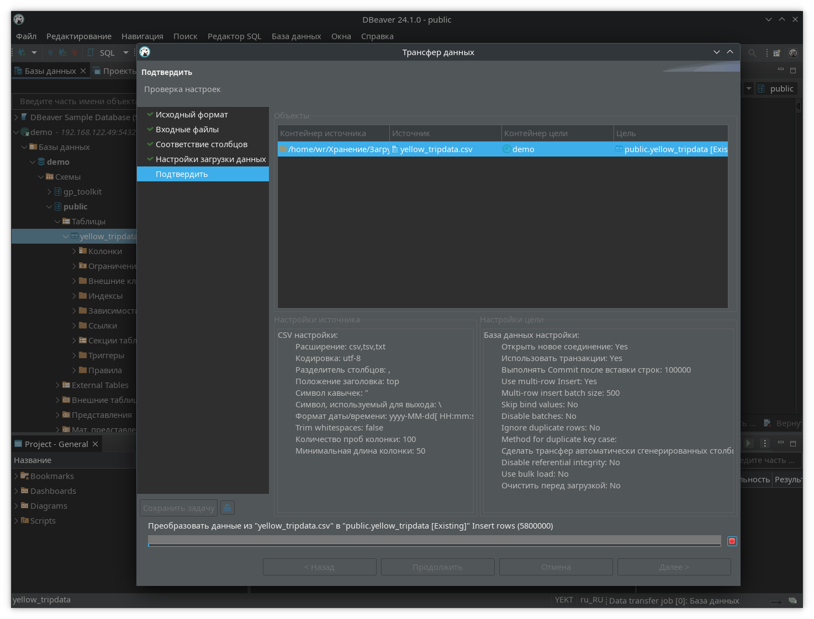

 
# Домашнее задание №15
В рамках данного задания выполняется запуск Greenplum, yugabyte
Для наиболее точного сравнения производительности, всё устанавливается на виртуальные машины с одинаковыми конфигурациями (8 ядер CPU, 16 гигабайт ОЗУ). Greenplum и ванильный PostgreSQL - на Ubuntu 24.04, Yugabyte - на minikube в режиме kvm. Greenplum будет запускаться на Docker из всё ещё доступного образа от VLDB.

Сравнение производительности будет выполнено с использованием датасета с данными такси Нью-Йорка, ранее использованный при выполнении одного из предыдущих заданий ([ссылка](https://www.kaggle.com/datasets/microize/newyork-yellow-taxi-trip-data-2020-2019) на датасет).

---
## Greenplum

### Подготовка - Docker
Для исключения влияния дисковой системы Docker на производительность, будет выполнено монтирование директории данных с хоста (точнее, виртуальной машины) в контейнер. Docker Rootless не подходит из-за изменяющихся uid файлов при монтировании в контейнер. Docker установлен из репозитория Ubuntu 24.04, т.к. его версия в данном случае непринципиальна, и пакет rootless-extras не требуется.

### Установка

Страница разработчика образа: [ссылка](https://vldb.gitbook.io/vldb-greenplum-demo/docker-installation/installing-container).

Загрузка образа и первоначальный запуск:
```
wr@bubuntu20042:~$ sudo docker pull docker.io/vldbuk/gpdb_demo_repo:gpdb_demo
wr@bubuntu20042:~$ sudo docker container run -ti -d --privileged=true -p 5432:5432 docker.io/vldbuk/gpdb_demo_repo:gpdb_demo "/usr/lib/systemd/systemd"
wr@bubuntu20042:~$ sudo docker ps
CONTAINER ID   IMAGE                             COMMAND                  CREATED         STATUS         PORTS                                       NAMES
ec1e5ea1b79b   vldbuk/gpdb_demo_repo:gpdb_demo   "/usr/lib/systemd/sy…"   8 minutes ago   Up 8 minutes   0.0.0.0:5432->5432/tcp, :::5432->5432/tcp   quizzical_wing
```
После запуска образа требуется скопировать содержимое директории данных greenplum из образа в файловую систему виртуальной машины, и исправить uid владельца на uid пользователя gpadmin в контейнере (можно также использовать facl):
```
wr@bubuntu20042:/tmp$ sudo docker cp -a ec1e:/gpdb /mnt/gpdb
Successfully copied 703MB to /tmp/gpdb
wr@bubuntu20042:~$ sudo chown -R 998 /mnt/gpdb/
```
Теперь пересоздадим контейнер, на этот раз с примонтированной директорией данных Greenplum:
```
wr@bubuntu20042:~$ sudo docker container stop ec1e
wr@bubuntu20042:~$ sudo docker container rm ec1e
wr@bubuntu20042:~$ sudo docker container run -ti -d --privileged=true -p 5432:5432 -v /mnt/gpdb:/gpdb docker.io/vldbuk/gpdb_demo_repo:gpdb_demo "/usr/lib/systemd/systemd"
```
Если контейнер запустился - можно считать что он готов к работе. Требуется запустить терминал внутри контейнера и запустить Greenplum:
```
wr@bubuntu20042:~$ sudo docker ps
CONTAINER ID   IMAGE                             COMMAND                  CREATED          STATUS          PORTS                                       NAMES
7c5417b63d62   vldbuk/gpdb_demo_repo:gpdb_demo   "/usr/lib/systemd/sy…"   40 seconds ago   Up 40 seconds   0.0.0.0:5432->5432/tcp, :::5432->5432/tcp   kind_stonebraker
wr@bubuntu20042:~$ sudo docker exec -it kind_stonebraker bash
```
И внутри контейнера:
```
[root@1c51a129ef80 /]# su - gpadmin
[gpadmin@1c51a129ef80 ~]$ gpstart -qa
```
После запуска требуется добавить запись в pg_hba.conf на мастере Greenplum, для открытия возможности подключения к СУБД:
```
[gpadmin@1c51a129ef80 ~]$ vi /gpdb/gpmaster/gpseg-1/pg_hba.conf
```
И после добавления требуемой строки перечитать конфигурацию greenplum:
```
[gpadmin@1c51a129ef80 ~]$ gpstop -u
```

### Тестирование

Для загрузки датасета при помощи утилиты psql создана таблица yellow_tripdata в стандартной базе данных demo:
```
demo=# CREATE TABLE public.yellow_tripdata (id SERIAL, 
        "VendorID" integer NULL,
        tpep_pickup_datetime varchar(50) NULL,
        tpep_dropoff_datetime varchar(50) NULL,
        passenger_count integer NULL,
        trip_distance real NULL,
        "RatecodeID" integer NULL,
        store_and_fwd_flag varchar(50) NULL,
        "PULocationID" integer NULL,
        "DOLocationID" integer NULL,
        payment_type integer NULL,
        fare_amount real NULL,
        extra integer NULL,
        mta_tax real NULL,
        tip_amount integer NULL,
        tolls_amount integer NULL,
        improvement_surcharge real NULL,
        total_amount real NULL,
        congestion_surcharge real NULL
) DISTRIBUTED BY (id);
CREATE TABLE
```
Датасет загружен при помощи DBeaver. Для ускорения загрузки включен multi-row insert (при обычной вставке загрузка выполняется очень медленно). Конфигурация импорта датасета:

После загрузки, были выполнены тесты по аналогии с одним из предыдущих заданий. Во-первых - включен таймер:
```
demo=# \timing on
Секундомер включён.
```
Выведено количество записей о поездках с количеством пассажиров, равным 6:
```
demo=# select count(*) from yellow_tripdata where passenger_count = 6;
  count  
---------
 2377311
(1 строка)

Время: 3250,746 мс (00:03,251)
```
Выведена информация о поездках за первые 10 минут 2020 года:
```
demo=# select * from yellow_tripdata where tpep_pickup_datetime like '%2020-01-01 00:00%';
Время: 11422,473 мс (00:11,422)
```
Выведено 49 строк.

## YugabyteDB

### Подготовка - minikube
Развертывание будет выполнено при помощи helm-чарта YugabyteDB, на локальный kubernetes - minikube. Для развертывания требуеьтся создать кластер с достаточным количеством ресурсов:
```
wr@main:~$ minikube start --cpus 8 --memory 16384 --disk-size='80000mb'
😄  minikube v1.33.1 на Debian 12.7
✨  Automatically selected the kvm2 driver. Other choices: qemu2, ssh
👍  Starting "minikube" primary control-plane node in "minikube" cluster
🔥  Creating kvm2 VM (CPUs=8, Memory=16384MB, Disk=80000MB) ...
🐳  Подготавливается Kubernetes v1.30.0 на Docker 26.0.2 ...
    ▪ Generating certificates and keys ...
    ▪ Booting up control plane ...
    ▪ Configuring RBAC rules ...
🔗  Configuring bridge CNI (Container Networking Interface) ...
🔎  Компоненты Kubernetes проверяются ...
    ▪ Используется образ gcr.io/k8s-minikube/storage-provisioner:v5
🌟  Включенные дополнения: storage-provisioner, default-storageclass

❗  /usr/bin/kubectl is version 1.20.2, which may have incompatibilities with Kubernetes 1.30.0.
    ▪ Want kubectl v1.30.0? Try 'minikube kubectl -- get pods -A'
🏄  Готово! kubectl настроен для использования кластера "minikube" и "default" пространства имён по умолчанию
```
После запуска minikube, требуется добавить helm-репозиторий YugabyteDB:
```
wr@main:~$ helm repo add yugabytedb https://charts.yugabyte.com
"yugabytedb" has been added to your repositories
wr@main:~$ helm repo update
Hang tight while we grab the latest from your chart repositories...
...Successfully got an update from the "yugabytedb" chart repository
...Successfully got an update from the "bitnami" chart repository
Update Complete. ⎈Happy Helming!⎈
```
Проверка доступности чарта:
```
wr@main:~$ helm search repo yugabytedb/yugabyte
NAME                    CHART VERSION   APP VERSION     DESCRIPTION                                       
yugabytedb/yugabyte     2024.1.2        2024.1.2.0-b77  YugabyteDB is the high-performance distributed ...
```
Отображается версия чарта 2024.1.2. Можно проверить доступность LTS-версии (на момент выполнения задания - 2.20):
```
wr@main:~$ helm search repo yugabytedb/yugabyte --version 2.20
NAME                    CHART VERSION   APP VERSION     DESCRIPTION                                       
yugabytedb/yugabyte     2.20.6          2.20.6.0-b66    YugabyteDB is the high-performance distributed ...
```
Её (LTS) и будем устанавливать. Подготовка namespace:
```
wr@main:~$ kubectl create namespace yb
namespace/yb created
```
Для установки в minikube или в других средах с ограниченными ресурсами, при установке требуется указать лимиты использования процессора и ОЗУ:
```
wr@main:~$ helm install yb-demo yugabytedb/yugabyte --version 2.20 --set resource.master.requests.cpu=1,resource.master.requests.memory=1Gi,resource.tserver.requests.cpu=1,resource.tserver.requests.memory=1Gi --namespace yb
NAME: yb-demo
LAST DEPLOYED: Mon Sep  9 20:24:16 2024
NAMESPACE: yb
STATUS: deployed
REVISION: 1
TEST SUITE: None
NOTES:
1. Get YugabyteDB Pods by running this command:
  kubectl --namespace yb get pods

2. Get list of YugabyteDB services that are running:
  kubectl --namespace yb get services

3. Get information about the load balancer services:
  kubectl get svc --namespace yb

4. Connect to one of the tablet server:
  kubectl exec --namespace yb -it yb-tserver-0 bash

5. Run YSQL shell from inside of a tablet server:
  kubectl exec --namespace yb -it yb-tserver-0 -- /home/yugabyte/bin/ysqlsh -h yb-tserver-0.yb-tservers.yb

6. Cleanup YugabyteDB Pods
  For helm 2:
  helm delete yb-demo --purge
  For helm 3:
  helm delete yb-demo -n yb
  NOTE: You need to manually delete the persistent volume
  kubectl delete pvc --namespace yb -l app=yb-master
  kubectl delete pvc --namespace yb -l app=yb-tserver
```
После запуска видно что есть проблемы с доступностью сервисов балансировщиков - статус `pending`:
```
wr@main:~$ kubectl -n yb get services
NAME                 TYPE           CLUSTER-IP     EXTERNAL-IP   PORT(S)                                                                      AGE
yb-master-ui         LoadBalancer   10.96.31.215   <pending>     7000:30360/TCP                                                               2m49s
yb-masters           ClusterIP      None           <none>        7000/TCP,7100/TCP                                                            2m49s
yb-tserver-service   LoadBalancer   10.103.4.181   <pending>     6379:31611/TCP,9042:31410/TCP,5433:31123/TCP                                 2m49s
yb-tservers          ClusterIP      None           <none>        9000/TCP,12000/TCP,11000/TCP,13000/TCP,9100/TCP,6379/TCP,9042/TCP,5433/TCP   2m49s
```
Проблема вызвана сильно упрощенной архитектурой minikube. Можно переустановить чарт с отключением балансировщиков:
```
wr@main:~$ helm uninstall yb-demo -n yb
release "yb-demo" uninstalled
wr@main:~$ helm install yb-demo yugabytedb/yugabyte --version 2.20 --set resource.master.requests.cpu=1,resource.master.requests.memory=1Gi,resource.tserver.requests.cpu=1,resource.tserver.requests.memory=1Gi,enableLoadBalancer=False --namespace yb
<...>
```
Сервисы в развернутом чарте с отключенными балансировщиками работают в режиме ClusterIP, поэтому подключение к tservers возможно только при помощи обычного проброса порта kubernetes:
```
wr@main:~$ kubectl -n yb port-forward svc/yb-tservers 5433:5433
Forwarding from 127.0.0.1:5433 -> 5433
Forwarding from [::1]:5433 -> 5433
```

### Тестирование
Подключиться к YugabyteDB для создания таблицы можно при помощи утилиты psql, аналогично подключению к стандартной СУБД PostgreSQL. Запрос для создания таблицы:
```
yugabyte=# CREATE TABLE public.yellow_tripdata (
        "VendorID" integer NULL,
        tpep_pickup_datetime varchar(50) NULL,
        tpep_dropoff_datetime varchar(50) NULL,
        passenger_count integer NULL,
        trip_distance real NULL,
        "RatecodeID" integer NULL,
        store_and_fwd_flag varchar(50) NULL,
        "PULocationID" integer NULL,
        "DOLocationID" integer NULL,
        payment_type integer NULL,
        fare_amount real NULL,
        extra integer NULL,
        mta_tax real NULL,
        tip_amount integer NULL,
        tolls_amount integer NULL,
        improvement_surcharge real NULL,
        total_amount real NULL,
        congestion_surcharge real NULL
);
CREATE TABLE
```
Загрузка датасета также выполнена при помощи DBeaver.

После загрузки датасета включен таймер и выполнены аналогичные запросы, для получения количества поездок с шестью пассажирами, и информации о поездках в первые 10 минут 2020 года (выведено также 49 строк):
```
yugabyte=# \timing on
Секундомер включён.
yugabyte=# select count(*) from yellow_tripdata where passenger_count = 6;
  count  
---------
 2377311
(1 строка)

Время: 30121,213 мс (00:30,121)
yugabyte=# select * from yellow_tripdata where tpep_pickup_datetime like '%2020-01-01 00:00%';
Время: 37192,167 мс (00:37,192)
```

## Стандартный PostgreSQL 16

Выполнена стандартная установка PostgreSQL 16.4 из репозитория Ubuntu 24.04. Выполнены только следующие настройки:
* в pg_hba.conf добавлена запись, разрешающая подключаться снаружи виртуальной машины;
* в postgresql.conf установлена опция `listen_addresses = '*'`.

Аналогичным образом создана таблица:
```
postgres=# CREATE TABLE public.yellow_tripdata (
        "VendorID" integer NULL,
        tpep_pickup_datetime varchar(50) NULL,
        tpep_dropoff_datetime varchar(50) NULL,
        passenger_count integer NULL,
        trip_distance real NULL,
        "RatecodeID" integer NULL,
        store_and_fwd_flag varchar(50) NULL,
        "PULocationID" integer NULL,
        "DOLocationID" integer NULL,
        payment_type integer NULL,
        fare_amount real NULL,
        extra integer NULL,
        mta_tax real NULL,
        tip_amount integer NULL,
        tolls_amount integer NULL,
        improvement_surcharge real NULL,
        total_amount real NULL,
        congestion_surcharge real NULL
);
CREATE TABLE
```
В эту таблицу при помощи DBeaver загружен датасет.
Выполнены те же самые запросы:
```
postgres=# \timing on
Секундомер включён.
postgres=# select count(*) from yellow_tripdata where passenger_count = 6;
  count  
---------
 2377311
(1 строка)

Время: 2051,120 мс (00:02,051)
postgres=# select * from yellow_tripdata where tpep_pickup_datetime like '%2020-01-01 00:00%';
Время: 2770,328 мс (00:02,770)
```

## Сравнение результатов
```
    Запрос      |      Greenplum      |     YugabyteDB    |    PostgreSQL (vanilla)
----------------------------------------------------------------------------------------
6 пассажиров    |    3250,746 мс      |    30121,213 мс   |      2051,120 мс
новый год 2020  |   11422,473 мс      |    37192,167 мс   |      2770,328 мс
```
В условиях одиночной тестовой инсталляции стандартный PostgreSQL работает быстрее из-за заметно меньшего потребления ресурсов. В моменты выполнения тестовых запросов к СУБД Greenplum и, особенно, Yugabyte, был очень заметен больший рост нагрузки на CPU компьютера.