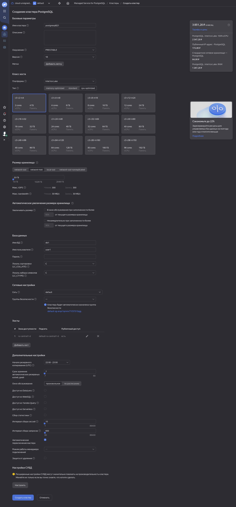
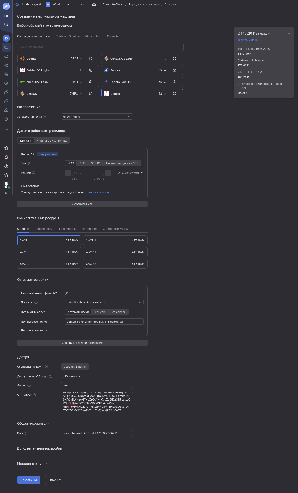
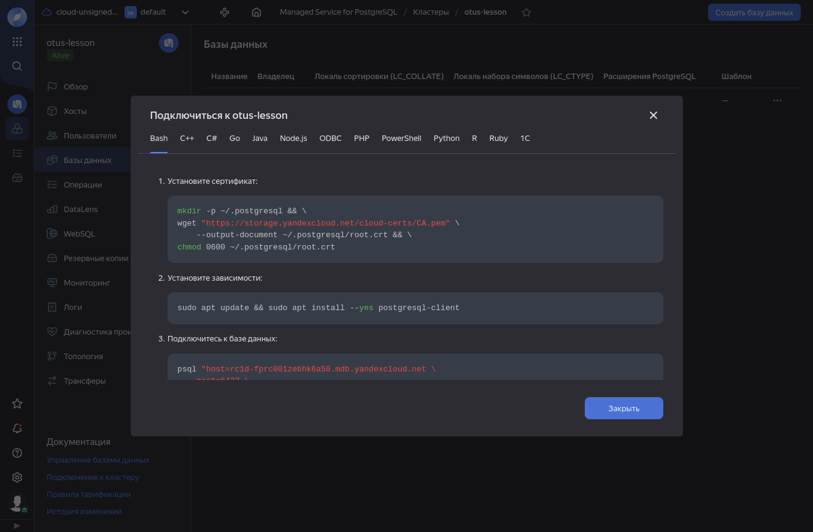
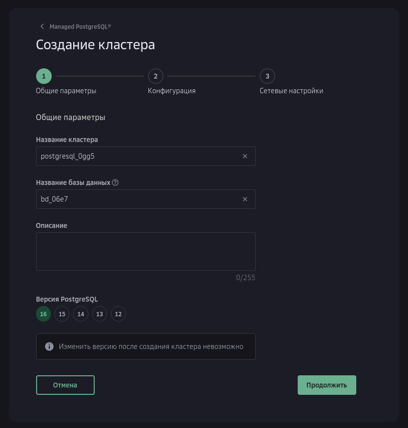
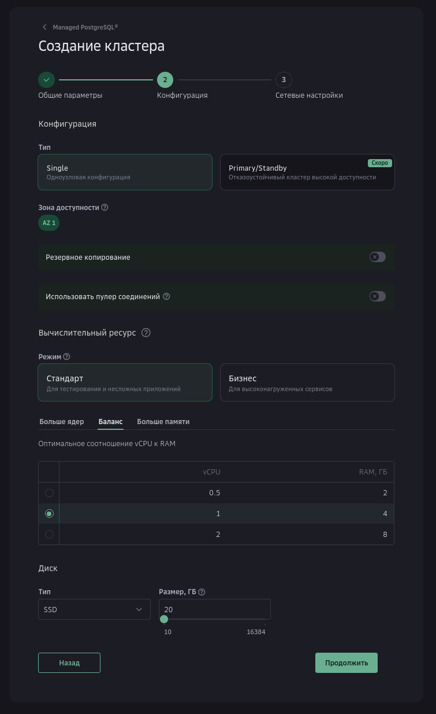
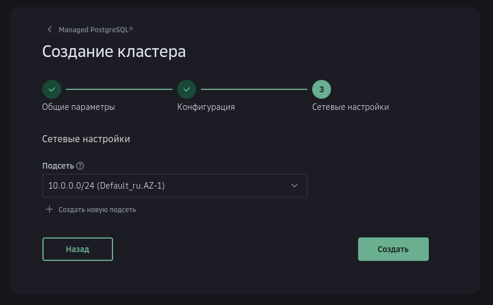
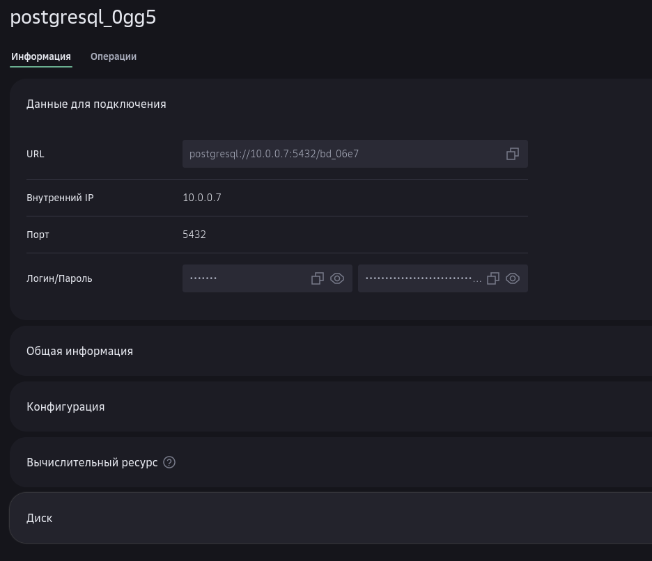
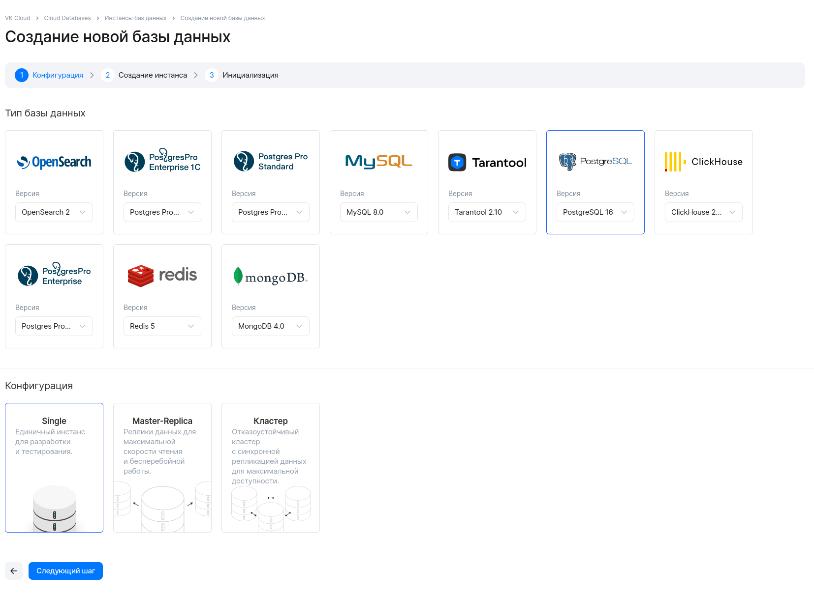
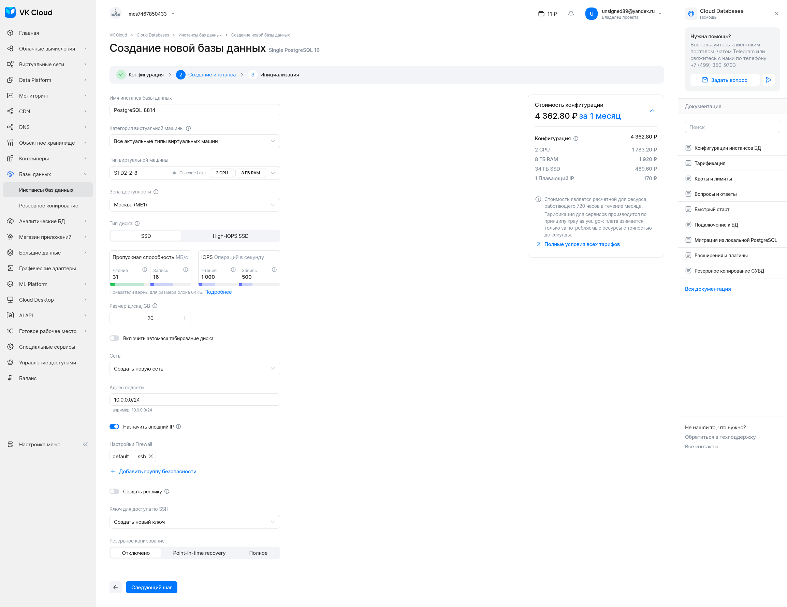
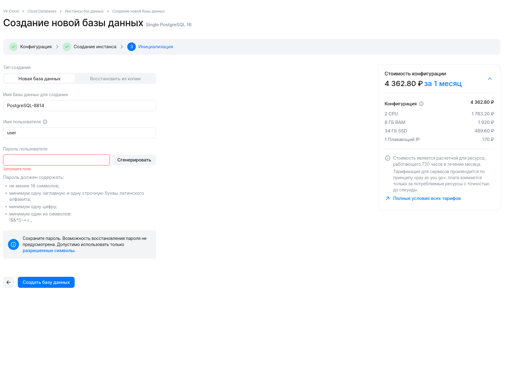

 
# Домашнее задание №19
В рамках данного задания выполняется знакомство с облачными сервисами, основанными на PostgreSQL

## Yandex Cloud

Яндекс предлагает возможность создания готового сервиса PostgreSQL - Managed service for PostgreSQL. 

Для создания кластера переходим в директорию Managed services for PostgreSQL. Задание выполняется на аккаунте, с которыми ранее облачные сервисы Яндекса не использовались, поэтому в этом меню можно только кликнуть на кнопку создания облачного сервиса.

<details>
<summary>Развернуть большой скриншот</summary>

</details>

При создании требуется указать:
* имя кластера;
* окружение (PRODUCTION для использования стабильной среды, PRESTABLE для использования новых версий ПО);
* версию PostgreSQL;
* выбрать платформу ЦП, указать количество ресурсов ЦП, ОЗУ, диск;
* при необходимости - включить автоматическое увеличение размера диска;
* создать пользователя и БД;
* сетевую зону и группу безопасности;
* перечислить хосты и при необходимости доступа к СУБД из интернета - добавить внешний IP.

Эти параметры можно указать при создании кластера через web-консоль, или через API при помощи утилиты yc. Утилита установлена и подключена к аккаунту по [инструкции](https://yandex.cloud/ru/docs/cli/operations/install-cli).

Пример команды для создания кластера с минимальными ресурсами для теста:
```
yc managed-postgresql cluster create --name otus-lesson --environment prestable --postgresql-version 16 --network-name default --resource-preset c3-c2-m4 --host zone-id=ru-central1-d,subnet-name=default-ru-central1-d --disk-size 20 --disk-type network-hdd --user name=wr,password=сложный_пароль --database name=wr,owner=wr,lc-collate=ru_RU.UTF-8,lc-ctype=ru_RU.UTF-8
```
После окончания создания кластера, команда выведет конфигурацию PostgreSQL и данные для подключения.

Развернутая СУБД доступна только внутри выбранной зоны доступности, для доступа требуется создать виртуальную машину в этой же зоне.
<details>
<summary>Развернуть большой скриншот</summary>

</details>

Создана виртуальная машина с небольшим количеством ресурсов, ОС - Debian 12. Из репозитория pgdg ([ссылка](https://www.postgresql.org/download/linux/debian/)) установлен пакет postgresql-client-16.

Для получения данных для подключения к БД требуется в web-интерфейсе перейти в список баз данных, кликнуть на символе с тремя точками напротив имени БД, и выбрать пункт "Подключиться". При этом будут отображены разные варианты подключения к БД, в том числе для утилиты psql.



Сначала требуется установить на виртуальную машину корневой сертификат
```
mkdir -p ~/.postgresql && \
wget "https://storage.yandexcloud.net/cloud-certs/CA.pem" \
    --output-document ~/.postgresql/root.crt && \
chmod 0600 ~/.postgresql/root.crt
```
Далее - подключиться:
```
user@compute-vm-2-2-10-hdd-1726056596712:~$ psql "sslmode=verify-full" -h rc1d-fprc001zebhk6a50.mdb.yandexcloud.net -p 6432 -U wr
Password for user wr: 
psql (16.4 (Debian 16.4-1.pgdg120+1), server 16.3 (Ubuntu 16.3-201-yandex.56999.5d27eb2dd6))
SSL connection (protocol: TLSv1.3, cipher: TLS_AES_256_GCM_SHA384, compression: off)
Type "help" for help.

wr=> SELECT version();
```

## Cloud.ru (оно же Sber Cloud)
Платформа cloud.ru также имеет возможность создания готовой СУБД PostgreSQL - "Managed PostgreSQL®".

Для создания первого кластера требуется перейти в меню Managed PostgreSQL и кликнуть на кнопку создания кластера. Первым шагом требуется указать название кластера, версию PostgreSQL, название первой БД:



Далее - указать конфигурацию кластера, выбрать зону доступности (на момент выполнения задания предлагалась только одна), при необходимости - включить резервное копирование и использование пулера, указать количество ресурсов - ядра CPU, объём ОЗУ, размер диска:



Далее - указать подсеть, после чего можно приступить к созданию кластера:



Кластер PostgreSQL не может быть доступен из интернета, поэтому для проверки возможности подключения к нему дополнительно требуется создать виртуальную машину, а также настроить SNAT-шлюз. На виртуальную машину установлен пакет postgresql-client-16, данные для подключения взяты со страницы базы данных:



В данном случае Cloud.ru не использует SSL для подключения к СУБД, что упрощает тестирование.
```
user1@vm-791136:~$ psql -h 10.0.0.7 -U dbadmin -d postgres
Password for user dbadmin: 
psql (16.4 (Debian 16.4-1.pgdg120+1), server 16.3 (Debian 16.3-1.pgdg110+1))
SSL connection (protocol: TLSv1.3, cipher: TLS_AES_256_GCM_SHA384, compression: off)
Type "help" for help.

postgres=> SELECT version();
```
Подключение успешно выполнилось, проверена версия СУБД:
```
version                                                           
-----------------------------------------------------------------------------------------------------------------------------
 PostgreSQL 16.3 (Debian 16.3-1.pgdg110+1) on x86_64-pc-linux-gnu, compiled by gcc (Debian 10.2.1-6) 10.2.1 20210110, 64-bit
(1 row)
```

## VK Cloud

VK Cloud также предоставляет возможность создания управляемого сервиса PostgreSQL. При создании возникли сложности, связанные с тем что сервис отказывается воспринимать виртуальные банковские карты для привязки к аккаунту (у проверенных выше YC и cloud.ru проблем с этим не возникало).

Для создания кластера требуется перейти в меню "Базы данных", выбрать PostgreSQL, и указать состав кластера:



Далее, требуется указать требуемые параметры СУБД:
* название;
* параметры виртуальной машины (ЦП, ОЗУ, диск) и место её размещения;
* автомасштабирование диска по умолчанию включено, отключим;
* настройки сети - внешний IP, межсетевой экран;
* резервное копирование по умолчанию включено, отключим;
* ключ для подключения по SSH.

<details>
<summary>Развернуть большой скриншот</summary>

</details>

После этого, потребуется указать имя пользователя и пароль для подключения к СУБД:



После создания инстанса СУБД, если не загрузить свой SSH-ключ скачается новый, с помощью которого можно подключиться к серверу СУБД. Далее, прямо на сервере можно при помощи утилиты psql подключиться к СУБД:

```
[admin@postgresql-8814 ~]$ psql -U user -d postgres
Пароль пользователя user: 
psql (16.3)
Введите "help", чтобы получить справку.

postgres=> SELECT version();
                                                 version                                                 
---------------------------------------------------------------------------------------------------------
 PostgreSQL 16.3 on x86_64-pc-linux-gnu, compiled by gcc (GCC) 8.5.0 20210514 (Red Hat 8.5.0-22), 64-bit
(1 строка)
```