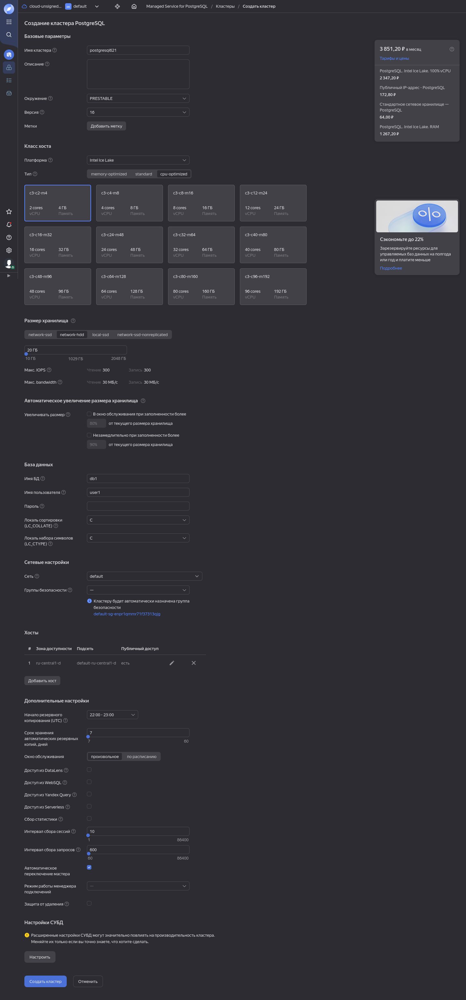
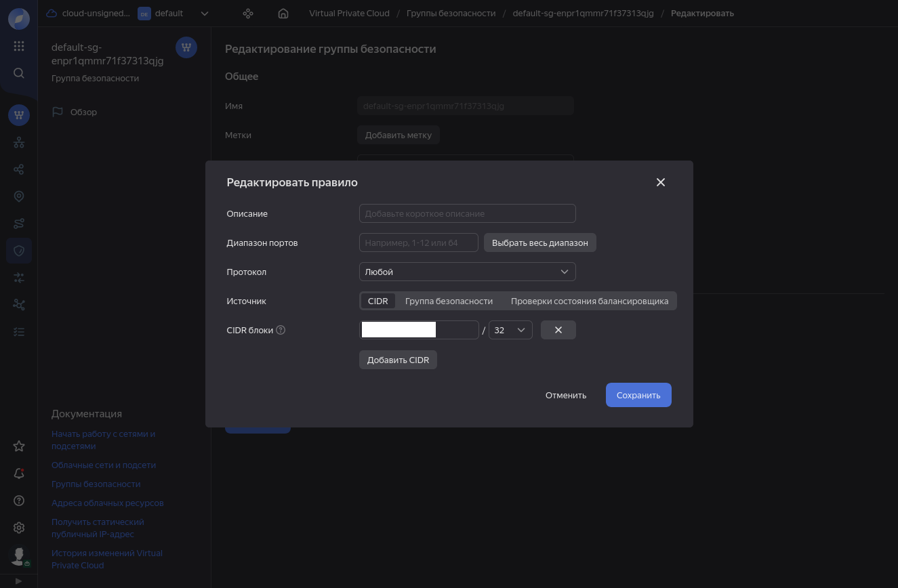
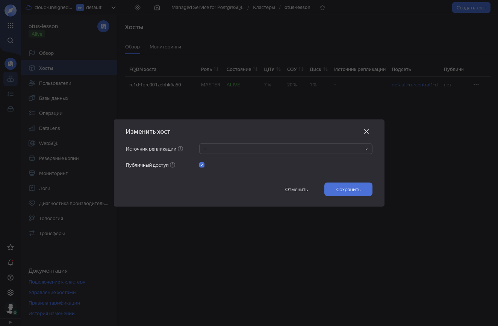
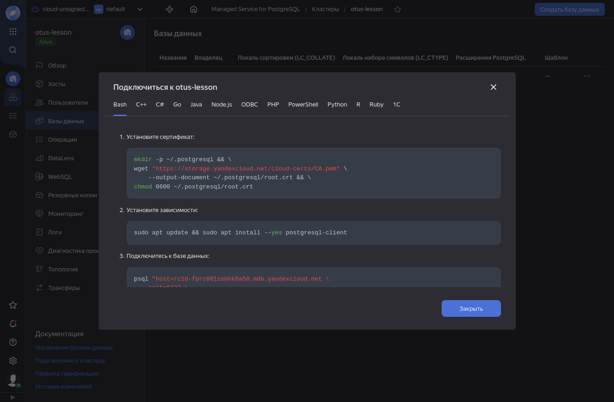

 
# Домашнее задание №22
В рамках данного задания выполняется создание кластера PostgreSQL в Yandex Cloud и подключение к нему из публичной сети

## Создание

Яндекс предлагает возможность создания готового сервиса PostgreSQL - Managed service for PostgreSQL. 

Для создания кластера переходим в директорию Managed services for PostgreSQL. Задание выполняется на аккаунте, с которыми ранее облачные сервисы Яндекса не использовались, поэтому в этом меню можно только кликнуть на кнопку создания облачного сервиса.

<details>
<summary>Развернуть большой скриншот</summary>

</details>

При создании требуется указать:
* имя кластера;
* окружение (PRODUCTION для использования стабильной среды, PRESTABLE для использования новых версий ПО);
* версию PostgreSQL;
* выбрать платформу ЦП, указать количество ресурсов ЦП, ОЗУ, диск;
* при необходимости - включить автоматическое увеличение размера диска;
* создать пользователя и БД;
* сетевую зону и группу безопасности;
* перечислить хосты и при необходимости доступа к СУБД из интернета - добавить внешний IP.

Эти параметры можно указать при создании кластера через web-консоль, или через API при помощи утилиты yc. Утилита установлена и подключена к аккаунту по [инструкции](https://yandex.cloud/ru/docs/cli/operations/install-cli).

Пример команды для создания кластера с минимальными ресурсами для теста:
```
yc managed-postgresql cluster create --name otus-lesson --environment prestable --postgresql-version 16 --network-name default --resource-preset c3-c2-m4 --host zone-id=ru-central1-d,subnet-name=default-ru-central1-d --disk-size 20 --disk-type network-hdd --user name=wr,password=сложный_пароль --database name=wr,owner=wr,lc-collate=ru_RU.UTF-8,lc-ctype=ru_RU.UTF-8
```
После окончания создания кластера, команда выведет конфигурацию PostgreSQL и данные для подключения.

## Настройка доступа и подключение

Развернутая СУБД доступна только внутри выбранной зоны доступности, для доступа требуется открыть доступ извне сети яндекса - назначить внешний IP-адрес. Так как полный доступ для всего интернета нельзя считать безопасным решением даже для целей тестирования, требуется ограничить доступ. Для ограничения доступа будет использован firewall в виде групп безопасности. Для целей тестирования можно внести изменения в созданную по умолчанию группу безопасности - исправить 0.0.0.0/0 на IP-адрес, с которого планируется подключаться.

После этого требуется перейти в каталог кластера СУБД, в меню "Хосты" напротив хоста кликнуть на кнопку редактирования, и включить публичный доступ.
.
После чего можно посмотреть данные для подключения к БД:

И попробовать подключиться с рабочего места:
```
wr@main:~$ psql "sslmode=verify-full" -h rc1d-fprc001zebhk6a50.mdb.yandexcloud.net -p 6432 -U wr
Пароль пользователя wr: 
psql (16.4 (Debian 16.4-1.pgdg120+1), сервер 16.3 (Ubuntu 16.3-201-yandex.56999.5d27eb2dd6))
SSL-соединение (протокол: TLSv1.3, шифр: TLS_AES_256_GCM_SHA384, сжатие: выкл.)
Введите "help", чтобы получить справку.

wr=>
```
По запросу `SELECT version();` отображаются данные сервера СУБД, значит установку можно считать успешной:
```
version                                                                     
-------------------------------------------------------------------------------------------------------------------------------------------------
 PostgreSQL 16.3 (Ubuntu 16.3-201-yandex.56999.5d27eb2dd6) on x86_64-pc-linux-gnu, compiled by gcc (Ubuntu 11.4.0-1ubuntu1~22.04) 11.4.0, 64-bit
(1 строка)
```
